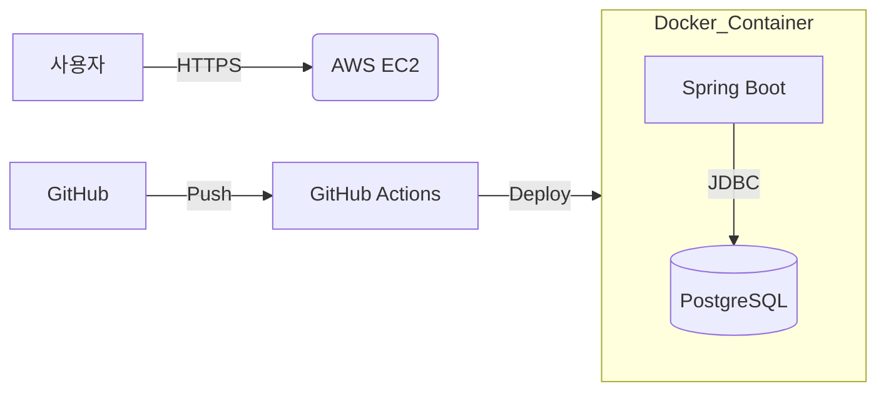

## Details

### 1. 왜 이 프로젝트인가? (Motivation)
배드민턴 동호회 활동을 하며 매번 엑셀이나 카톡으로 관리되는 경기 기록과 코트 예약의 불편함을 느꼈습니다. 이를 자동화하는 동시에, 현대오토에버 SW 스쿨에서 학습한 **안정적인 백엔드 설계 원칙**과 **DevOps 환경 구축**을 실제 서비스에 적용해보고자 시작했습니다.

### 2. 기술적 도전과 해결 (Technical Challenges)

#### "JUnit을 활용한 비즈니스 로직 검증"
단순히 기능이 동작하는 것을 넘어, 수정에 유연하고 신뢰할 수 있는 구조를 만들고 싶었습니다.
- **해결**: 서비스 레이어에 JUnit5와 Mockito를 도입하여 비즈니스 로직 테스트 커버리지를 확보했습니다. 이를 통해 리팩터링 시 발생할 수 있는 부작용(Side Effect)을 사전에 차단하고 코드의 품질을 유지하고 있습니다.

#### "객체지향 원칙(SOLID)의 적용"
요구사항 변화에 유연하게 대응하기 위해 인터페이스와 추상화를 적극 활용했습니다.
- **해결**: 구체적인 기술(DB, 외부 API)에 의존하지 않고 인터페이스에 의존하도록 설계하여, 향후 기술 스택 변경 시 비즈니스 로직의 수정을 최소화할 수 있는 구조를 확립했습니다.

### 3. 인프라 및 DevOps (Infrastructure)
로컬 개발 환경과 운영 환경의 간극을 줄이기 위해 **Docker**를 전적으로 활용했습니다.
- **CI/CD**: GitHub Actions를 사용하여 코드가 Push되면 자동으로 테스트를 수행하고 AWS EC2에 Docker 컨테이너로 배포되는 파이프라인을 구축했습니다.
- **환경 분리**: `application-dev.yml`과 `application-prod.yml`을 분리하여 각 환경에 최적화된 설정을 관리하고 있습니다.

### 4. 아키텍처 다이어그램

### 5. 성과 및 배운 점
- 처음으로 인프라의 전 과정을 직접 구축하며 네트워크 설정과 보안 그룹 관리 등 인프라 전반에 대한 실무적 이해도를 높였습니다.
- 테스트 코드 작성이 단순한 작업 시간의 증가가 아니라, 장기적으로는 결함을 줄여 전체적인 개발 생산성과 신뢰도를 높여준다는 것을 깊이 체감했습니다.
