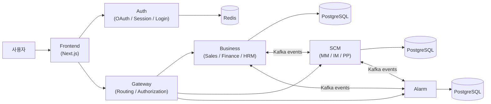
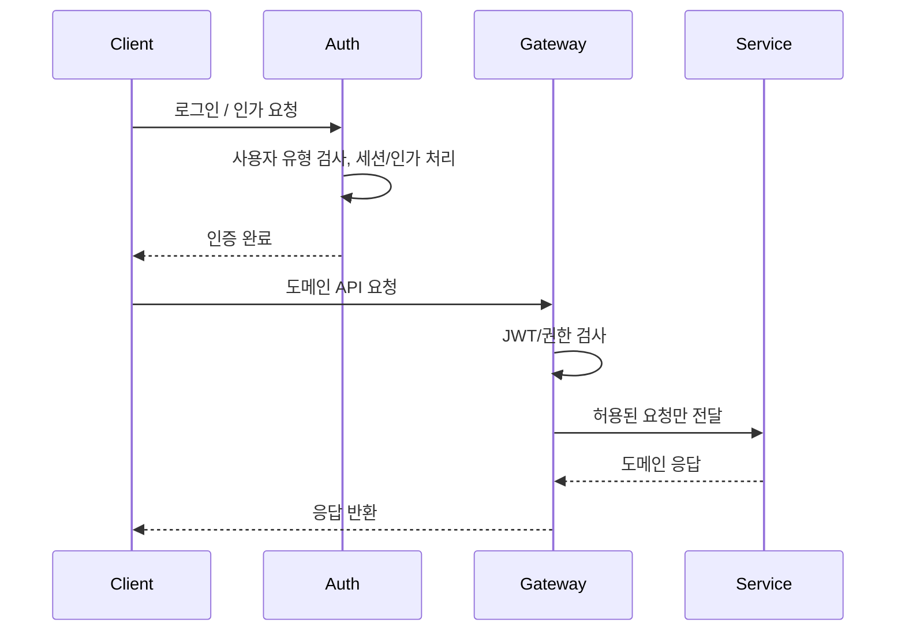
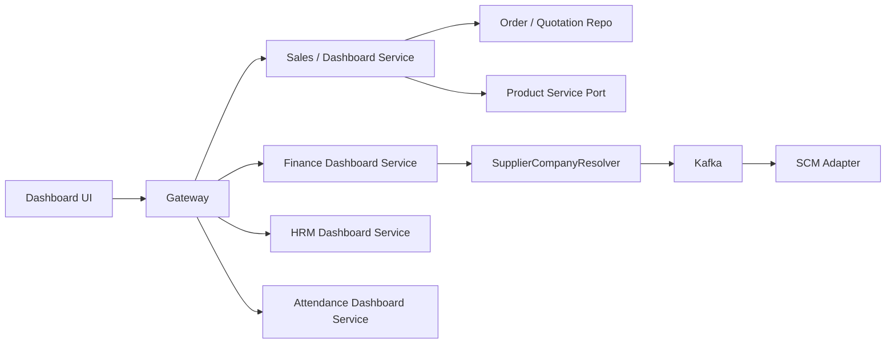

## 시스템 아키텍처

4EVER는 FE, Auth, Gateway, Business, SCM, Alarm을 분리한 구조로 설계되었습니다. 서비스 경계를 먼저 나눠 둔 덕분에 인증·권한, 도메인 처리, 알림, 대시보드 집계의 책임을 분리해서 다룰 수 있었습니다.

### 시스템 컨텍스트

- **Auth**: 로그인, OAuth 인가 흐름, 세션/토큰 처리, 사용자 유형 제한
- **Gateway**: 클라이언트가 접근하는 단일 진입점, 도메인 서비스 라우팅, 권한 검사
- **Business**: 영업, 재무, 인사, 대시보드 집계 성격의 API
- **SCM**: 발주, 재고, 생산, 제품 관련 API
- **Alarm**: 이벤트 기반 알림 전달

### 인증 및 권한 흐름
프로젝트 후반부에는 "로그인은 Auth에서 처리하고, 권한 해석은 Gateway에서 일관되게 적용한다"는 기준을 명확히 두었습니다.

- Auth에서 모바일 클라이언트의 로그인 가능 사용자 유형을 제한
- Gateway에서 모듈별 엔드포인트에 `@PreAuthorize`를 추가해 역할 기반 접근 제어 적용
- 서비스는 권한 판단보다 도메인 처리에 집중하도록 책임 분리

### 대시보드 집계 흐름
대시보드는 단순 조회 화면이 아니라, 주문·견적·매입·생산 상태를 한눈에 볼 수 있어야 했습니다. 그래서 개별 도메인 API를 그대로 노출하기보다, 대시보드에 맞춘 집계 API를 별도로 정리했습니다.

- 주문/견적은 대시보드 workflow item 형식으로 가공
- 제품명, 고객사명 같은 표시용 데이터는 별도 조회 후 결합
- 공급사 회사명처럼 서비스 경계를 넘는 정보는 Kafka 기반 비동기 요청/응답으로 해결
- 실데이터가 없는 초기 단계에는 목업 fallback을 두어 화면 개발과 API 개발을 병행

### 서비스 운영 관점에서 중요했던 구조
- **경계 분리**: 인증 성공 자체와 API 접근 허용은 다른 문제로 보고 Auth와 Gateway에 나눠 배치
- **조합형 API**: ERP는 화면 하나가 여러 도메인 데이터를 요구하므로, 조회 전용 조합 API가 중요
- **초기화 가능성**: 모듈별 계정과 제품 데이터를 반복 생성할 수 있어야 팀 전체가 같은 시나리오를 재현 가능
- **비동기 연계**: 모든 도메인 조회를 동기 호출로 연결하지 않고, 필요한 구간은 Kafka 이벤트로 분리
