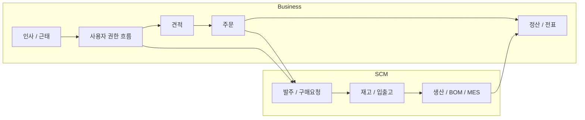
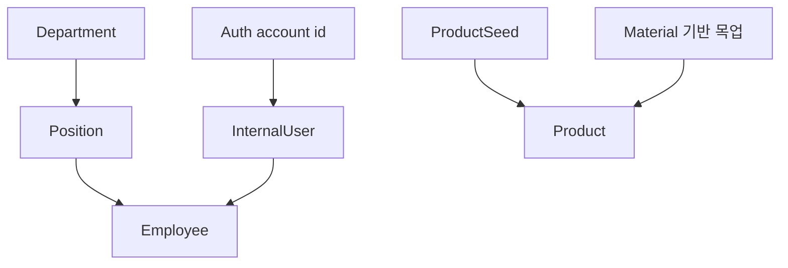

## 3. 도메인 데이터 구조

이 프로젝트에서는 실제 ERD를 정교하게 그리는 것보다, **어떤 서비스가 어떤 데이터를 소유하고 어떤 업무 이벤트를 처리할지**를 먼저 정리하는 것이 더 중요했습니다. ERP는 단일 엔티티보다 견적, 주문, 발주, 재고, 생산, 정산, 사용자 생성 같은 흐름이 연쇄적으로 이어지는 구조였기 때문에, 데이터 구조를 서비스 경계와 대표 트랜잭션 기준으로 함께 보는 편이 더 현실적이었습니다.

### 서비스별 데이터 소유

| 서비스 | 핵심 데이터 | 주 역할 | 묶은 이유 |
| --- | --- | --- | --- |
| Auth | 사용자 계정, OAuth 클라이언트, 인가/토큰 흐름, JWT claims | 인증과 사용자 유형 제어 | ERP 전체의 공통 인증 축이라 별도 서비스로 분리 |
| Business | 견적, 주문, 고객 사용자, 재무 전표, 인사/근태, 대시보드 집계용 데이터 | 영업·재무·인사 관점의 업무 처리 | 사무/운영 관점의 업무가 사용자·거래·정산 문맥을 공유 |
| SCM | 공급사, 제품, 발주, 재고, BOM, 생산 관련 데이터 | 자재·재고·생산 흐름 관리 | 제품/자재 lifecycle과 물류 흐름이 강하게 결합 |
| Alarm | 알림 이벤트, 읽음 상태, 전송 기록 | 상태 변화 알림 처리 | 여러 도메인의 상태 변화를 소비하는 공통 이벤트 축 |

### 왜 Business와 SCM 두 축으로 나눴는가

모든 ERP 도메인을 처음부터 `Sales`, `Finance`, `HRM`, `MM`, `IM`, `PP` 같은 독립 서비스로 세분 MSA화하는 것이 이상적으로 보일 수는 있습니다. 하지만 당시 팀 규모와 개발 기간, 운영 복잡도를 함께 고려하면, Auth·Gateway·Alarm을 공통 축으로 두고 ERP 핵심 도메인을 Business와 SCM 두 서버로 묶는 구성이 가장 현실적이라고 판단했습니다.

- **Business**는 견적, 주문, 고객사, 전표, 인사처럼 "사람이 의사결정하고 화면에서 바로 다루는 데이터"를 중심으로 묶었습니다.
- **SCM**은 공급사, 제품, 발주, 재고, BOM, 생산처럼 "제품과 자재의 흐름이 이어지는 데이터"를 중심으로 묶었습니다.
- 이렇게 두 축으로 잡으면 화면 요구사항이 많은 사무형 업무와, 상태 전이가 많은 공급망/생산형 업무를 분리할 수 있으면서도 초기 운영 복잡도는 과하게 높아지지 않았습니다.
- 즉, 본편 시점의 설계 기준은 "최대한 잘게 나누기"보다 "제한된 자원 안에서 가장 설명 가능하고 운영 가능한 경계 만들기"에 가까웠습니다.

### 핵심 도메인 흐름
ERP에서 중요한 것은 단일 테이블보다 **업무 흐름 상의 연결**이었습니다. 특히 어떤 이벤트가 Business에서 시작되고, 어디서부터 SCM의 책임으로 넘어가는지를 구분하는 것이 중요했습니다.

- 견적, 주문, 고객 사용자, 정산은 Business에서 관리하는 사무형 업무 흐름이었습니다.
- 발주, 재고, 제품, BOM, 생산은 SCM에서 이어지는 공급망/제조 흐름이었습니다.
- 주문 이후 발주가 이어지고, 생산 결과가 다시 정산이나 대시보드 집계에 반영되면서 두 축이 연결되었습니다.
- 모든 흐름의 접근 가능 여부는 Auth와 Gateway에서 해석한 사용자 유형과 권한에 따라 달라졌습니다.

### 대표 트랜잭션 맵

도메인 데이터 구조를 설명할 때는 "어떤 테이블이 있느냐"보다 "어떤 업무 트랜잭션이 어느 서비스 사이를 건너가느냐"가 더 중요했습니다. 본편에서 중요했던 대표 흐름은 아래와 같았습니다.

| 트랜잭션 | 시작 서비스 | 연계 서비스 | 통신 방식 | 트랜잭션 포인트 |
| --- | --- | --- | --- | --- |
| 내부 사용자 생성 | Business(HRM) | Auth | Kafka 이벤트 + 결과 이벤트 | `transactionId`로 계정 생성 결과를 추적하고 실패 시 Saga 보상 |
| 공급사 생성 | SCM(MM) | Auth | Kafka 이벤트 + 결과 이벤트 | 공급사 엔티티와 사용자 계정을 함께 성공시켜야 하는 분산 트랜잭션 |
| 공급사 정보 조회 | Business(FCM) | SCM(MM) | Kafka request/reply | 경계 데이터 조회, timeout, pending result 관리 |
| 발주 승인 -> 전표 생성 | SCM(MM) | Business(FCM) | Kafka 완료 이벤트 | 구매주문 승인 이후 전표 생성 완료를 비동기 결과로 연결 |
| 견적 확정 / 주문 전환 | Business(SD) | SCM 후속 흐름 | 동기 API + 후속 상태 전이 | 판매 이벤트가 발주·생산 흐름의 시작점이 되도록 상태를 분리 |
| MES 시작 / 완료 | SCM(PP) | SCM 내부 흐름 + Alarm | Kafka 완료 이벤트 | 생산 단계 결과를 `transactionId` 기준 완료 이벤트로 추적 |

### 화면 중심 데이터 조합
실제 대시보드나 목록 화면에서는 한 서비스의 엔티티만으로는 충분하지 않았습니다.

- 주문 대시보드에는 주문 번호뿐 아니라 제품명, 고객사명, 상태, 생성일이 함께 필요
- 공급사 매입 전표 화면에는 전표 데이터 외에 공급사 회사 정보가 함께 필요
- 인사/모듈 테스트를 위해서는 부서, 직급, 내부 사용자, Auth 계정 ID가 함께 맞물려야 함

즉, 데이터 설계 관점에서는 다음 두 층이 동시에 필요했습니다.

1. 각 서비스가 소유하는 원본 도메인 데이터
2. 화면/운영 시나리오를 위한 조합형 조회 데이터

### 초기화 데이터 구조
프로젝트 후반에는 개발 환경에서 시나리오를 재현하기 위한 시드 구조를 강화했습니다.

- `InternalUserInitializer`는 모듈별 이메일 규칙과 Auth 계정 ID 매핑을 기준으로 내부 사용자를 생성
- `ProductInitializer`는 제품/자재 목업을 단순 문자열이 아니라 `productId`가 있는 구조로 정리
- 이 초기화 구조 덕분에 모듈별 테스트 계정, 제품, 권한 시나리오를 반복 실행 가능

### 더 세밀하게 MSA를 분리한다면

이 아래 내용은 본편 구현 기록이라기보다, 이번 프로젝트를 다시 쪼갠다면 어떤 경계가 더 자연스러울지에 대한 **확장 설계 메모**입니다.

| 후보 서비스 | 소유 데이터/책임 | 이벤트/조회 경계 |
| --- | --- | --- |
| Sales | 견적, 주문, 고객사, 영업 workflow | 제품/재고 조회는 IM read model을 참조하고, 주문 확정 이벤트를 PP/MM으로 전달 |
| Finance | 매입/매출 전표, 정산, 지급/수납 상태 | 구매 승인, 생산 완료 같은 상태 이벤트를 받아 전표와 정산 흐름을 갱신 |
| HRM | 부서, 직급, 사원, 근태, 급여 트리거 | Auth에 사용자 생성 이벤트를 발행하고, Gateway 권한과 연결되는 조직 정보를 제공 |
| MM | 공급사, 자재 조달, 구매요청/발주 | 공급사 마스터와 발주 승인 이벤트를 외부에 제공하고, Finance와 연결 |
| IM | 창고, 재고, 입출고, 제품 read model | Sales와 PP가 조회 중심으로 참조하는 재고/제품 경계를 담당 |
| PP | BOM, 생산 계획, MES 시작/완료 | 주문 확정이나 자재 준비 상태를 받아 생산 이벤트를 발행 |
| Auth | 사용자 계정, OAuth 클라이언트, 인가/토큰, JWT claims | HRM/MM에서 들어오는 사용자 생성 요청을 처리하고 결과 이벤트를 반환 |
| Gateway | 외부 진입점, 토큰 검증, 권한 해석, 하위 서비스 라우팅 | 내부 서비스의 직접 결합을 줄이고, 정책과 진입 경계를 일관되게 유지 |
| Alarm | 알림 구독, 읽음 상태, 전송 기록 | 도메인 서비스가 발행한 상태 변경 이벤트를 소비해 사용자 알림으로 전환 |
