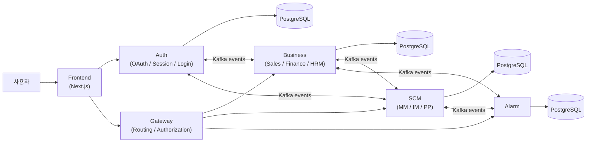
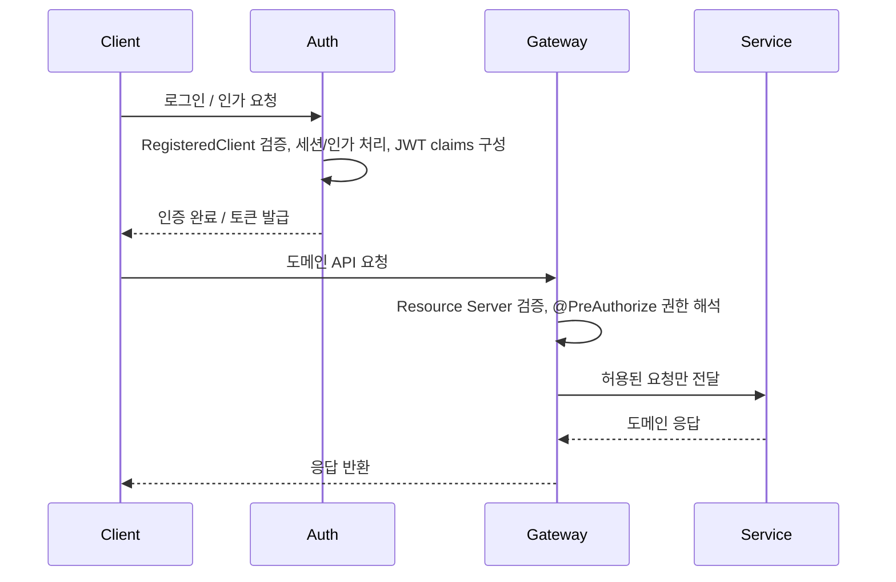
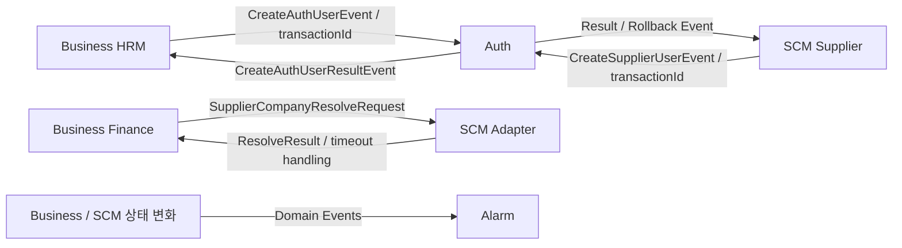

## 시스템 아키텍처

4EVER는 FE, Auth, Gateway, Business, SCM, Alarm을 분리한 구조로 설계되었습니다. 이 구조의 핵심은 "기본 진입은 Gateway, 인증은 Auth, 실제 업무 도메인 처리는 Business와 SCM, 상태 변화 알림은 Alarm"으로 축을 명확히 두는 것이었습니다. 모든 서버를 처음부터 세분 MSA로 쪼개지는 않았지만, OAuth, 권한 경계, 비동기 트랜잭션이 어디에서 다뤄져야 하는지 설명 가능한 구조를 만드는 것이 우선 목표였습니다.

### 시스템 컨텍스트

- 클라이언트는 Auth에서 로그인과 OAuth 인가를 처리하고, 실제 업무 API는 Gateway를 통해 진입합니다.
- Gateway는 Kafka producer/consumer의 중심이 아니라, 인증 이후의 단일 진입점과 권한 해석 지점입니다.
- Auth, Business, SCM은 사용자 생성과 공급사 생성, 공급사 정보 조회 같은 교차 서비스 흐름에서 Kafka와 `transactionId` 기반 연계를 사용합니다.
- Alarm은 여러 도메인의 상태 이벤트를 소비해 알림으로 전환하는 공통 이벤트 소비 축입니다.

### 인증 및 권한 흐름
프로젝트에서 가장 공을 많이 들인 축은 Auth와 Gateway를 분리한 OAuth 기반 인증/인가 구조였습니다. Auth에서는 Authorization Server, 클라이언트 등록, 로그인 성공 처리, JWT claims 구성을 맡고, Gateway에서는 Resource Server, JWK 기반 토큰 검증, `@PreAuthorize` 기반 권한 해석을 맡도록 역할을 분리했습니다.

- Auth에서 PostgreSQL 기반 OAuth2 스키마, 클라이언트 등록, 로그인 성공 처리, 모바일 클라이언트 제한을 구현했습니다.
- Gateway에서 OAuth2 Resource Server를 붙이고, 도메인별 엔드포인트에 `@PreAuthorize`를 추가해 역할 기반 접근 제어를 일관되게 적용했습니다.
- 이 구조 덕분에 "인증 성공"과 "업무 API 접근 허용"을 별개 문제로 나눠 다룰 수 있었습니다.

### Kafka와 트랜잭션 연계
Kafka는 모든 서버의 기본 통신 수단이라기보다, **도메인 경계를 넘어가야 하는 일부 업무 이벤트**를 안전하게 연결하기 위한 도구로 사용했습니다. 제가 직접 커밋한 Kafka 중심 구현도 Auth, Business, SCM, Alarm 축에 집중돼 있었고, Gateway는 이 흐름의 producer/consumer가 아니라 외부 진입과 권한 해석에 집중했습니다.

- **Auth**: 사용자 생성 이벤트 리스너, 결과 이벤트, Saga 상태 관리 같은 인증 계정 생성 축을 담당했습니다.
- **Business / SCM**: `transactionId`, `DeferredResult`, Saga, request/reply를 이용해 내부 사용자 생성, 공급사 생성, 공급사 정보 조회, 전표/생산 완료 흐름을 연결했습니다.
- **Alarm**: 도메인 이벤트를 소비해 알림으로 변환하는 이벤트 소비 축으로 두었습니다.
- **Gateway**: Kafka 처리 주체가 아니라 외부 요청을 받아 권한을 해석하고 내부 서비스로 라우팅하는 역할에 집중했습니다.

### 서비스 운영 관점에서 중요했던 구조
- **인증과 인가의 분리**: 로그인과 토큰 발급은 Auth에서, 업무 접근 판단은 Gateway에서 처리하도록 나눴습니다.
- **현실적인 MSA 경계**: 본편에서는 Business와 SCM 두 축으로 핵심 도메인을 묶어 운영 복잡도를 통제했습니다.
- **선택적 비동기 연계**: 모든 통신을 이벤트화하지 않고, 사용자 생성이나 공급사 조회처럼 경계를 넘는 지점만 Kafka로 분리했습니다.
- **설명 가능한 트랜잭션**: 서비스 간 흐름은 `transactionId`와 완료 이벤트 기준으로 추적하고, 실패 시 보상 구조를 붙일 수 있게 설계했습니다.
