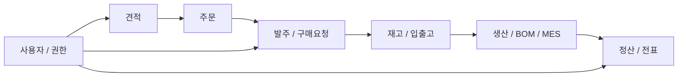
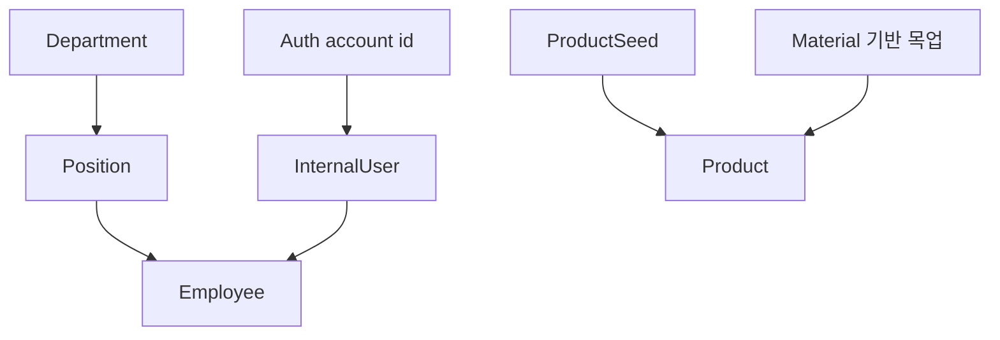

## 도메인 데이터 구조

이 프로젝트에서는 실제 ERD를 완성도 있게 그리는 것보다, **어떤 서비스가 어떤 데이터를 소유하고 어떤 흐름으로 연결되는지**를 먼저 정리하는 것이 더 중요했습니다. 아래 내용은 README와 실제 커밋에서 확인 가능한 수준의 도메인 구조를 기준으로 정리했습니다.

### 서비스별 데이터 소유

| 서비스 | 핵심 데이터 | 역할 |
| --- | --- | --- |
| Auth | 사용자 계정, 로그인 상태, 인가 요청 흐름 | 로그인과 사용자 유형 판별, 세션/인가 처리 |
| Business | 견적, 주문, 고객 사용자, 재무/대시보드 집계용 데이터 | 영업·재무·인사 관점의 도메인 처리 |
| SCM | 제품, 발주, 재고, BOM, 생산 관련 데이터 | 자재/재고/생산 흐름 관리 |
| Alarm | 알림 이벤트, 읽음 상태 | 상태 변화 알림 처리 |

### 핵심 도메인 흐름
ERP에서 중요한 것은 단일 테이블보다 **업무 흐름 상의 연결**이었습니다.

- 견적과 주문은 영업 도메인의 핵심 흐름
- 발주, 재고, 생산은 SCM에서 이어지는 후속 처리
- 정산과 전표는 재무 도메인에서 별도 관리
- 모든 흐름의 접근 가능 여부는 사용자 유형과 권한에 따라 달라짐

### 화면 중심 데이터 조합
실제 대시보드나 목록 화면에서는 한 서비스의 엔티티만으로는 충분하지 않았습니다.

- 주문 대시보드에는 주문 번호뿐 아니라 제품명, 고객사명, 상태, 생성일이 함께 필요
- 공급사 매입 전표 화면에는 전표 데이터 외에 공급사 회사 정보가 함께 필요
- 인사/모듈 테스트를 위해서는 부서, 직급, 내부 사용자, Auth 계정 ID가 함께 맞물려야 함

즉, 데이터 설계 관점에서는 다음 두 층이 동시에 필요했습니다.

1. 각 서비스가 소유하는 원본 도메인 데이터
2. 화면/운영 시나리오를 위한 조합형 조회 데이터

### 초기화 데이터 구조
프로젝트 후반에는 개발 환경에서 시나리오를 재현하기 위한 시드 구조를 강화했습니다.

- `InternalUserInitializer`는 모듈별 이메일 규칙과 Auth 계정 ID 매핑을 기준으로 내부 사용자를 생성
- `ProductInitializer`는 제품/자재 목업을 단순 문자열이 아니라 `productId`가 있는 구조로 정리
- 이 초기화 구조 덕분에 모듈별 테스트 계정, 제품, 권한 시나리오를 반복 실행 가능

### 이 구조에서 얻은 판단 기준
- 권한은 데이터 모델의 부가 정보가 아니라 전체 업무 흐름의 진입 조건
- 대시보드용 데이터는 원본 엔티티를 그대로 노출하는 대신, 집계/조합 결과로 제공하는 편이 유지보수에 유리
- 목업 데이터도 도메인 규칙과 맞물려야 이후 실데이터 전환 시 비용이 줄어듦
