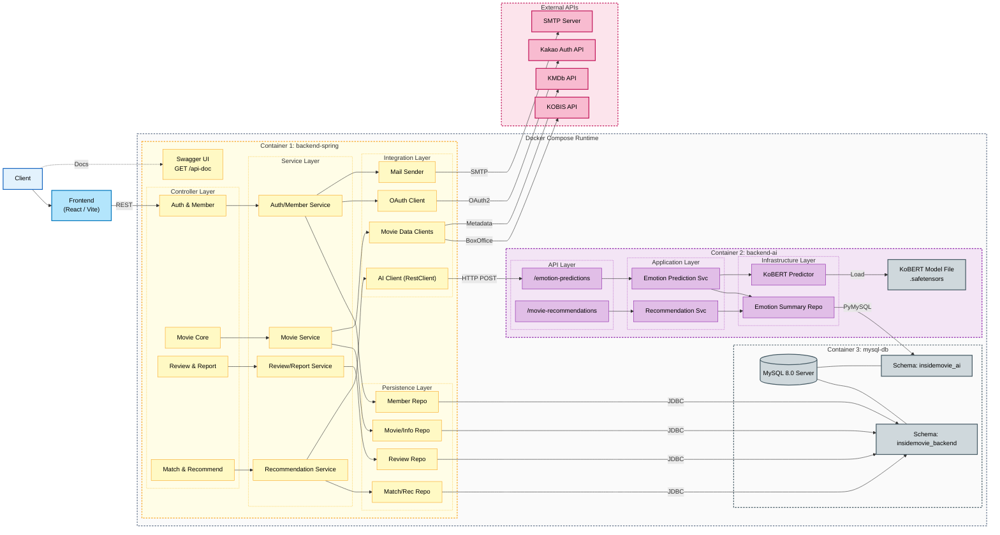

# 1. 프로젝트 개요
인사이드 무비는 리뷰 커뮤니티 기능에 감정분석 기반 추천을 결합한 서비스입니다.

핵심 백엔드 과제는 `리뷰 작성 -> 감정분석 -> 추천 반영` 흐름이 외부 의존성이나 입력 데이터 편차로 깨지지 않도록 안정화하는 것이었습니다.

이 문서에서는 프로젝트 기간 중 제가 직접 해결한 문제를 기준으로, 인증/접근 제어 정합성, 외부 AI 연동 실패 대응, 감정 데이터 정합성 개선 과정을 정리했습니다.

- - -
# 2. 시스템 아키텍처

## 2.1 백엔드 아키텍처 구조 (프로젝트 종료 시점)


## 2.2 요청 흐름 (핵심 시나리오)
`리뷰 작성 -> ReviewService -> /api/v1/emotion-predictions -> Emotion 저장 -> 요약 재계산`

## 2.3 Multi-Schema 실제 구성 (Insidemovie-monorepo 기준)
- MySQL 초기화 SQL에서 두 스키마를 생성합니다.
  - `insidemovie_backend`
  - `insidemovie_ai`
- Backend(Spring Boot)는 `insidemovie_backend`를 사용합니다.
  - `application-prod.yml`: `${BACKEND_DB_NAME:insidemovie_backend}`
- AI(FastAPI)는 `insidemovie_ai`를 사용합니다.
  - `docker-compose.yml`: `DATABASE_URL=.../insidemovie_ai`
- 확인한 근거 파일:
  - `docker/mysql/initdb/01-create-databases.sql`
  - `docker-compose.yml`
  - `apps/backend/src/main/resources/application-prod.yml`

- - -
# 3. 핵심 트러블슈팅 Top3 (프로젝트 기간 중)

## 3.1 인증/접근 제어 정합성
| As-Is
공개 조회 API와 인증 필요 API 경계가 일관되지 않아 비인증 조회에서 401/403 오동작이 발생했습니다.

| Root Cause
보안 경로 정책과 토큰 검증 로직이 분산되어 실제 공개해야 할 경로가 누락되었습니다.

| To-Be
공개 GET 경로를 상수로 분리하고 `boxoffice` 경로를 명시적으로 permitAll 처리했습니다. 또한 JWT null/blank 검증을 선행해 인증 필터 동작을 단순화했습니다.

| Code Evidence
```java
private static final String[] PUBLIC_GET_ENDPOINTS = {
    "/api/v1/movies/search/**",
    "/api/v1/movies/popular",
    "/api/v1/boxoffice/**"
};

.requestMatchers(HttpMethod.GET, PUBLIC_GET_ENDPOINTS).permitAll();

public boolean validateToken(String token) {
    if (token == null || token.isBlank()) return false;
    // parse + validate
}
```

| Commit Evidence
- `1eb2561` (boxoffice endpoint 정합화)
- `236db2a` (boxoffice 공개 경로 반영)
- `346f551` (JWT 검증 구조 개선)

| Verification
- 비인증 사용자로 `GET /api/v1/boxoffice/**` 호출 시 정상 조회
- 인증 필요 엔드포인트는 기존대로 401/403 보안 정책 유지

| Recurrence Prevention
- 공개 API 추가 시 `PUBLIC_GET_ENDPOINTS`/`PUBLIC_POST_ENDPOINTS`에 먼저 반영
- 보안 정책 변경 시 공개/보호 엔드포인트를 체크리스트로 리뷰

## 3.2 외부 연동 실패 대응 (FastAPI 감정분석)
| As-Is
리뷰 저장 흐름에서 FastAPI 호출 실패가 발생하면 서비스 응답이 불안정해졌습니다.

| Root Cause
외부 연동 실패를 도메인 예외로 표준화하지 않아 실패 케이스 처리 일관성이 낮았습니다.

| To-Be
FastAPI 응답 null/호출 예외를 `ExternalServiceException`으로 통일해 상위 계층에서 동일한 예외 계약으로 처리하도록 정리했습니다.

| Code Evidence
```java
try {
    PredictResponseDTO response = fastApiRestClient.post()
        .uri("/api/v1/emotion-predictions")
        .body(request)
        .retrieve()
        .body(PredictResponseDTO.class);

    if (response == null || response.getProbabilities() == null) {
        throw new ExternalServiceException(ErrorStatus.EXTERNAL_SERVICE_ERROR.getMessage());
    }
} catch (RestClientException e) {
    throw new ExternalServiceException(ErrorStatus.EXTERNAL_SERVICE_ERROR.getMessage());
}
```

| Commit Evidence
- `efc1427` (리뷰 작성 시 감정분석 연동 + 실패 처리)
- `6c8bdef` (외부 서비스 예외 타입 추가)

| Verification
- FastAPI 비정상 응답/네트워크 실패 상황에서 예외 코드 일관성 확인
- 리뷰 작성/수정 API에서 동일한 실패 응답 포맷 유지 확인

| Recurrence Prevention
- 외부 시스템 연동 시 `null 응답 + 클라이언트 예외`를 기본 실패 템플릿으로 강제
- 신규 외부 연동 API는 동일한 도메인 예외 타입 사용

## 3.3 감정 데이터 정합성 (입력 범위 + 대표감정 계산)
| As-Is
감정 입력 스케일과 요약 계산 로직 불일치로 대표 감정 결과가 왜곡될 수 있었습니다.

| Root Cause
입력 DTO 검증 범위와 실제 전달 데이터 스케일이 달랐고, 요약 재계산 시 대표 감정 계산 시점이 일관되지 않았습니다.

| To-Be
감정 입력 검증을 `0~100`으로 정합화하고, 요약 재계산 단계에서 대표 감정을 명시적으로 계산 후 반영하도록 변경했습니다.

| Code Evidence
```java
@NotNull @Min(0) @Max(100)
private Float joy;

EmotionAvgDTO avgDto = emotionRepository.findAverageEmotionsByMovieId(movieId)
    .orElseGet(() -> EmotionAvgDTO.builder().joy(0.0).sadness(0.0)
        .anger(0.0).fear(0.0).disgust(0.0).repEmotionType(EmotionType.NONE).build());

EmotionType rep = movieService.calculateRepEmotion(avgDto);
avgDto.setRepEmotionType(rep);
summary.updateFromDTO(avgDto);
```

| Commit Evidence
- `53aeac7` (감정 DTO 범위 0~100)
- `ff72cbc` (대표 감정 계산 오류 개선)

| Verification
- 감정 입력값 100 초과 시 검증 실패 확인
- 리뷰 등록/수정 후 대표 감정 필드가 재계산되어 반영되는지 확인

| Recurrence Prevention
- 감정 도메인 입력/응답 스케일을 API 계약에 고정
- 집계 로직 변경 시 대표 감정 계산 테스트 케이스를 필수화

## 3.4 공개 API/인터페이스/타입 변경 사항
- `GET /api/v1/boxoffice/**` 공개 접근 정책 반영
- 내부-외부 연동 계약: `POST /api/v1/emotion-predictions` + 실패 예외 표준화
- 타입 검증 변경: `MemberEmotionSummaryRequestDTO` 감정 값 범위 `0~100`

## 3.5 테스트/검증 시나리오
1. 비인증 사용자 `GET /api/v1/boxoffice/**` 접근 성공 여부
2. FastAPI 오류/무응답 시 일관된 예외 응답 확인
3. 감정 입력값 100 초과 시 검증 실패 확인
4. 리뷰 등록/수정 후 감정 요약 재계산 반영 확인

- - -
# 4. ERD (프로젝트 종료 시점)
| ERD 이미지
`[프로젝트 종료 시점 ERD 이미지 첨부 예정]`

| 설명 초안
- 핵심 엔티티 관계는 `Member - Review - Movie`를 중심으로 구성했습니다.
- `MemberEmotionSummary`, `MovieEmotionSummary`는 집계/추천용 읽기 모델 역할입니다.
- 리뷰-감정은 1:1 제약으로 중복 감정 저장을 방지했습니다.
- 쓰기 모델과 요약 모델을 분리해 추천 조회 계산 비용을 줄이도록 설계했습니다.

- - -
# 5. 프로젝트 개선 (종료 이후)
## 5.1 모노레포/실행 재현성
- 개선 전: 서비스별 실행/설정 경로가 분산되어 온보딩 비용이 높았습니다.
- 개선 후: `docker-compose`, `make` 기반으로 프론트/백엔드/AI 통합 실행 경로를 표준화했습니다.
- 관련 이력: `5b3edfb`, `47a8b1d`, `1359d00`

## 5.2 REST/ProblemDetail 정합화
- 개선 전: 도메인별 엔드포인트/오류 응답 포맷 차이로 계약 관리가 어려웠습니다.
- 개선 후: `/api/v1` REST 경로와 ProblemDetail 오류 응답을 백엔드/AI에서 정합화했습니다.
- 관련 이력: `3d8225f`, `70ba945`, `933fbba`

## 5.3 Swagger 계약 고도화
- 개선 전: 구현과 문서의 동기화가 늦어 협업 시 해석 차이가 있었습니다.
- 개선 후: Swagger/OpenAPI를 최신 계약(`userId`, `users`) 기준으로 정비했습니다.
- 관련 이력: `4e4aea2`, `9938488`

- - -
# 6. 회고
```reflection
이번 프로젝트를 통해 기능 구현보다도
인증 정책, 외부 연동 실패 처리, 데이터 정합성과 같은
운영 안정성 요소를 먼저 설계하는 것이 중요하다는 점을 배웠습니다.

또한 프로젝트 종료 이후 모노레포, REST 계약, Swagger 문서화를 진행하며
"동작하는 코드"와 "재현 가능하고 협업 가능한 구조"는 다르다는 점을 체감했습니다.
앞으로도 안정성/정합성/협업 계약을 우선순위로 두고 백엔드 설계를 고도화할 계획입니다.
```
