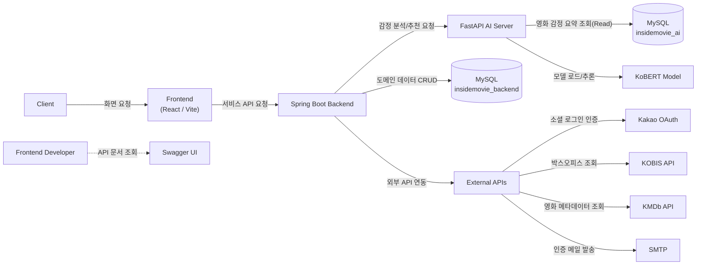
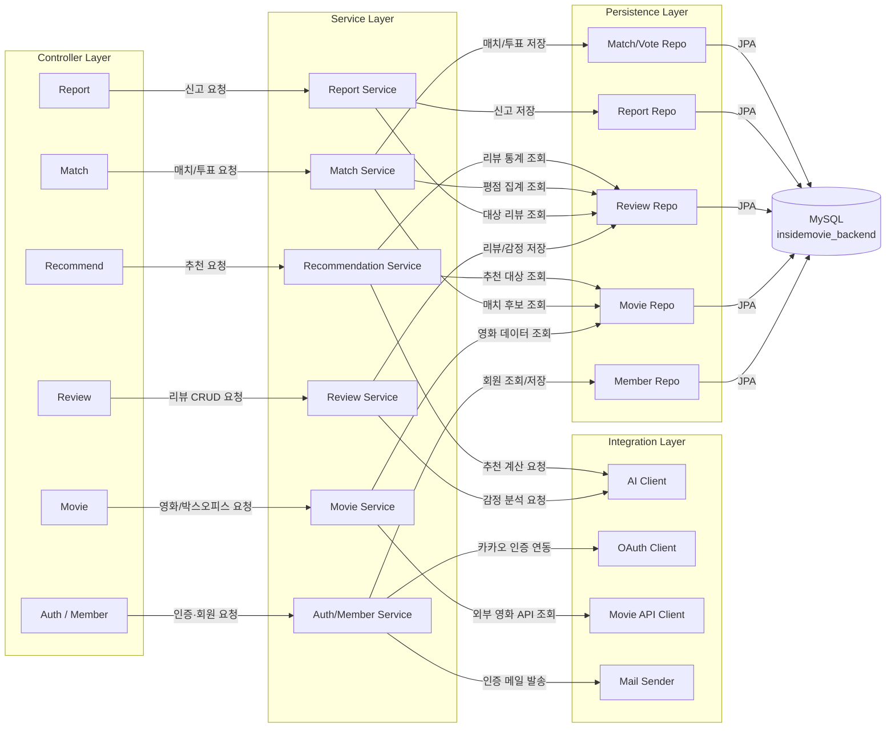
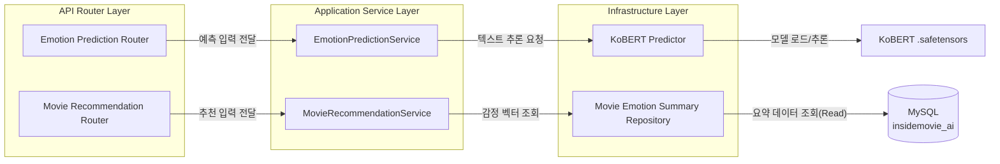
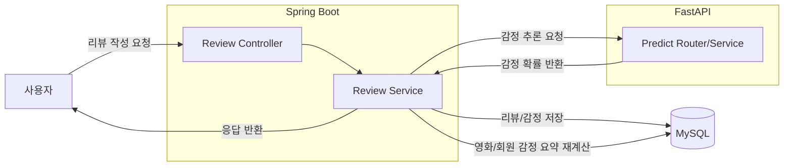
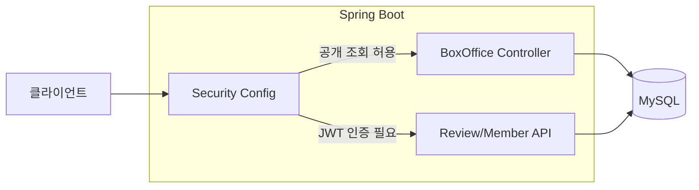
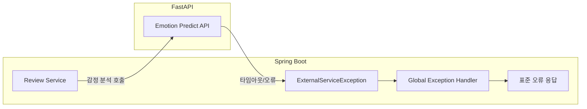
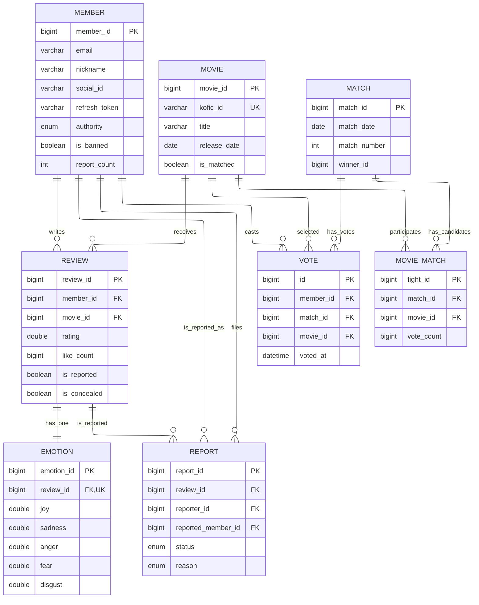
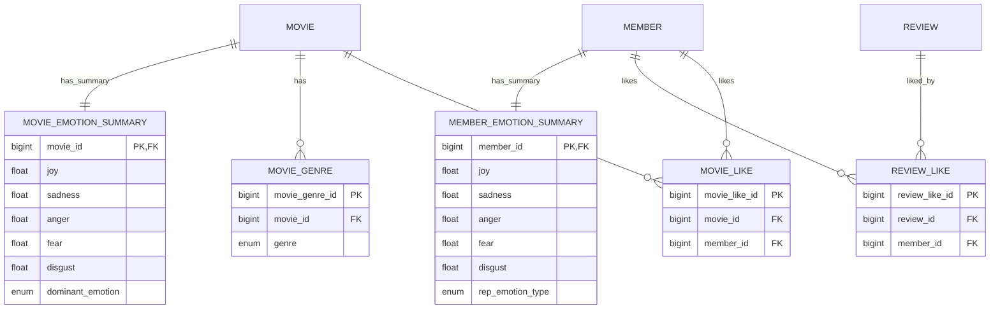
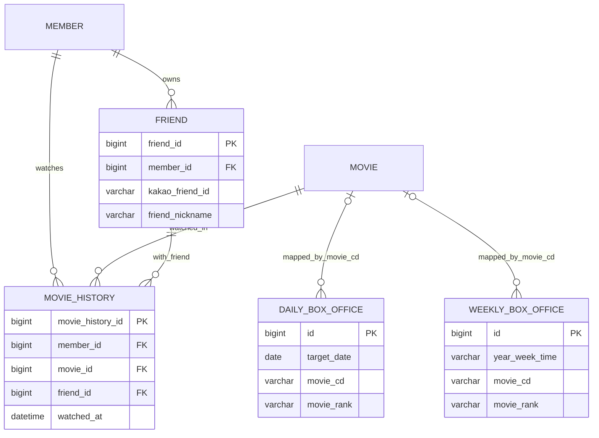

## 1. 프로젝트 개요 및 목표

**인사이드 무비**는 사용자 리뷰 텍스트를 감정 분석해 영화 추천에 반영하는 **영화 리뷰/추천 커뮤니티 서비스**입니다.
- - -
### 배경 및 목적
기존의 영화 커뮤니티들은 사용자가 영화에 대한 리뷰를 작성해도 그 정보가 사용자 개인화로 이어지지 않았습니다.
즉, 서비스 로직이 리뷰 작성 단계에서 끝나고, 사용자 리뷰 기반 추천으로 연결되는 흐름이 없었습니다.

이 프로젝트의 목표는 레이어드 아키텍처와 SOLID 원칙을 기반으로 벡엔드 기본기를 갖춘 API 서버를 구축하고,
사용자 리뷰 텍스트틀 AI 감정분석으로 처리하여 영화를 추천하는 커뮤니티 서비스를 만드는 것이었습니다.
- - -
### 역할 및 달성 목표
프로젝트에서 데이터 모델링, 백엔드 API 설계/구현, AI 추론 연동을 담당했습니다.

#### 역할 및 기여
- **백엔드 API 설계 및 구현 (Movie/Review/Member/Auth)**: 영화·박스오피스·리뷰·회원/인증 도메인의 API 계약과 서비스 흐름을 설계했습니다.  
  박스오피스 조회/상세 API와 외부 영화 데이터 연동을 구현해 조회 기능의 실행 경로를 완성했습니다.
  ```chips
  BoxOfficeController | https://github.com/AutoeverInsideMovie/Insidemovie-BE/blob/a1cb4ed/src/main/java/com/insidemovie/backend/api/movie/controller/BoxOfficeController.java#L25 | code
  BoxOfficeService | https://github.com/AutoeverInsideMovie/Insidemovie-BE/blob/a1cb4ed/src/main/java/com/insidemovie/backend/api/movie/service/BoxOfficeService.java#L60 | code
  0f25f7f | https://github.com/AutoeverInsideMovie/Insidemovie-BE/commit/0f25f7f | commit
  a1cb4ed | https://github.com/AutoeverInsideMovie/Insidemovie-BE/commit/a1cb4ed | commit
  ```
- **인증/인가 및 보안 정책 정비 (Member/Auth)**: JWT 검증 규칙과 공개/보호 API 경로 정책을 정리했습니다.  
  인증 처리 기준을 일관화해 도메인별 접근 제어 해석 차이를 줄였습니다.
  ```chips
  SecurityConfig | https://github.com/AutoeverInsideMovie/Insidemovie-BE/blob/d605bba/src/main/java/com/insidemovie/backend/common/config/security/SecurityConfig.java#L91 | code
  JwtProvider | https://github.com/AutoeverInsideMovie/Insidemovie-BE/blob/346f551/src/main/java/com/insidemovie/backend/api/jwt/JwtProvider.java#L89 | code
  d605bba | https://github.com/AutoeverInsideMovie/Insidemovie-BE/commit/d605bba | commit
  346f551 | https://github.com/AutoeverInsideMovie/Insidemovie-BE/commit/346f551 | commit
  ```
- **리뷰-감정분석 연동 (Spring ↔ FastAPI)**: 리뷰 작성 시 감정 추론 호출과 외부 예외 표준화를 구현했습니다.  
  리뷰 데이터가 추천 로직으로 이어지는 연계 파이프라인을 구성했습니다.
  ```chips
  ReviewService | https://github.com/AutoeverInsideMovie/Insidemovie-BE/blob/efc1427/src/main/java/com/insidemovie/backend/api/review/service/ReviewService.java#L44 | code
  ExternalServiceException | https://github.com/AutoeverInsideMovie/Insidemovie-BE/blob/6c8bdef/src/main/java/com/insidemovie/backend/common/exception/ExternalServiceException.java#L6 | code
  efc1427 | https://github.com/AutoeverInsideMovie/Insidemovie-BE/commit/efc1427 | commit
  6c8bdef | https://github.com/AutoeverInsideMovie/Insidemovie-BE/commit/6c8bdef | commit
  ```
- **데이터 정합성 및 AI 추론 구성**: 감정 입력/요약 계산 정합성을 보강하고 KoBERT 추론 서버를 구성했습니다.  
  감정 데이터의 저장·집계 기준을 맞춰 추천 입력 데이터의 일관성을 강화했습니다.
  ```chips
  MemberEmotionSummaryRequestDTO | https://github.com/AutoeverInsideMovie/Insidemovie-BE/blob/53aeac7/src/main/java/com/insidemovie/backend/api/member/dto/emotion/MemberEmotionSummaryRequestDTO.java#L14 | code
  MovieEmotionSummaryService | https://github.com/AutoeverInsideMovie/Insidemovie-BE/blob/ff72cbc/src/main/java/com/insidemovie/backend/api/movie/service/MovieEmotionSummaryService.java#L28 | code
  prediction service | https://github.com/AutoeverInsideMovie/Insidemovie-AI/blob/742123c/services/prediction.py#L11 | code
  53aeac7 | https://github.com/AutoeverInsideMovie/Insidemovie-BE/commit/53aeac7 | commit
  ff72cbc | https://github.com/AutoeverInsideMovie/Insidemovie-BE/commit/ff72cbc | commit
  742123c | https://github.com/AutoeverInsideMovie/Insidemovie-AI/commit/742123c | commit
  ```
- - -
#### 기술적 달성 목표
- Spring Boot 레이어드 아키텍처(Controller/Service/Repository)로 책임 경계를 명확히 분리
- JPA 기반 엔티티 관계 및 제약 조건 설계로 데이터 정합성 확보
- 리뷰/감정 데이터를 사용자 취향 신호로 구조화
- 리뷰 작성 → FastAPI 감정 분석 → Emotion 저장 → 요약 재계산 → 추천 반영 흐름 구현
- JWT 기반 인증/인가와 공개·보호 API 정책 분리로 접근 제어 일관성 확보
- 외부 API/AI 호출 실패를 공통 예외로 표준화해 API 응답 일관성 강화

- - -
## 2. 시스템 아키텍처
시스템은 Spring Boot API 서버와 FastAPI AI 추론 서버로 구성되어 있으며, MySQL 단일 인스턴스 내에 backend/ai 스키마를 분리하여 운영했습니다.

### 2.1 시스템 컨텍스트
클라이언트 요청은 Spring Boot가 수신하고, 감정 분석은 FastAPI에게 위임하며, 데이터는 MySQL 스키마 분리 구조로 저장됩니다.


### 2.2 Spring Boot 내부 구조
Spring Boot는 레이어드 아키텍터(`Controller` - `Service` - `Repository`)로 구성하여 인증, 리뷰, 영화/박스오피스 등의 도메인 로직을 분리했습니다.


### 2.3 FastAPI 내부 구조
FastAPI는 KoBERT 기반 감정 추론 전용 서버로 동작하며, 예측 결과를 Spring Boot에 반환하는 내부 AI 서비스 역할을 담당합니다.

- - -
### 2.4 핵심 시나리오
#### 2.4.1 리뷰 작성 -> 감정분석 -> 감정 요약 반영



- 목적: 리뷰 이벤트를 감정 데이터로 변환해 추천 기반 데이터에 반영합니다.
- 예외 처리: AI 호출 실패 시 공통 예외로 변환해 일관된 오류 응답을 반환합니다.
- 결과: 리뷰 작성과 감정 요약 갱신이 하나의 흐름으로 연결됩니다.

#### 2.4.2 박스오피스 공개 조회와 인증 API 분리



- 목적: 비인증 조회 API와 인증 필요 API의 경계를 명확히 분리합니다.
- 예외 처리: 인증이 필요한 경로는 인증 실패 시 401/403으로 처리됩니다.
- 결과: 공개 조회 사용성은 유지하고 보호 API 접근 제어는 강화됩니다.

#### 2.4.3 외부 AI 연동 실패 대응 표준화



- 목적: 외부 의존 실패가 전체 API 동작을 불안정하게 만들지 않도록 합니다.
- 처리: 외부 호출 예외를 도메인 예외로 변환하고 공통 포맷으로 응답합니다.
- 결과: 장애 상황에서도 응답 규격이 유지되어 클라이언트 처리 일관성이 높아집니다.

- - -
## 3. DB 구조
#### 3.1 핵심 도메인 ERD (회원/영화/리뷰/신고/매치)
핵심 사용자 플로우(회원 활동, 리뷰 작성, 신고, 매치 투표) 중심 관계입니다.



#### 3.2 상세 도메인 ERD (선호/장르/집계 읽기모델)
핵심 도메인 위에서 동작하는 선호(Like), 장르 매핑, 감정 집계용 읽기 모델 관계입니다.



#### 3.3 상세 도메인 ERD (운영/로그/박스오피스)
운영성 데이터(친구, 시청 이력, 박스오피스 수집 데이터)를 분리한 관계입니다.



- - -
## 4. 트러블 슈팅

~~~troubleshooting
제목: 인증/접근 제어 정합성

문제:
공개 조회 API와 인증 필요 API의 경계가 일관되지 않아 비인증 요청에서 401/403 오동작이 발생했습니다.
그 결과, 비인증 사용자의 조회 플로우가 차단되거나 보호 경로 정책이 오인될 가능성이 있었습니다.

원인:
보안 경로 정책과 토큰 검증 기준이 분산되어, 공개 경로 정의가 Security 설정에 일관되게 반영되지 않았습니다.

해결:
공개 GET 경로를 `requestMatchers`에서 명시적으로 분리하고 `/api/v1/boxoffice/**`를 `permitAll`로 고정했습니다.
또한 JWT `null/blank` 입력을 먼저 차단해 토큰 검증 동작을 단순화했습니다.

**Code Evidence**
```chips
As-Is | | asis
```
```java
// 문제: boxoffice 공개 경로가 빠져 비인증 조회 정책이 누락됨
.requestMatchers(
        HttpMethod.GET,
        "/api/v1/movies/*/emotion-summary",
        "/api/v1/movies/emotions/*",
        "/api/v1/movies/*/reviews"
).permitAll();

public boolean validateToken(String token) {
    // 문제: null/blank 토큰을 선차단하지 않아 불필요한 파싱 예외가 발생할 수 있음
    try {
        Jwts.parserBuilder().setSigningKey(key).build().parseClaimsJws(token);
        return true;
    } catch (Exception e) {
        log.info("JWT 검증 실패: {}", e.getMessage());
    }
    return false;
}
```

```chips
To-Be | | tobe
```
```java
// 개선: boxoffice 경로를 공개 목록에 명시해 조회 정책을 명확히 분리
.requestMatchers(
        HttpMethod.GET,
        "/api/v1/movies/*/emotion-summary",
        "/api/v1/movies/emotions/*",
        "/api/v1/movies/*/reviews",
        "/api/v1/boxoffice/**"
).permitAll();

public boolean validateToken(String token) {
    // 개선: null/blank 토큰을 선차단해 검증 흐름을 단순화
    if (token == null || token.isBlank()) {
        return false;
    }
    try {
        Jwts.parserBuilder().setSigningKey(key).build().parseClaimsJws(token);
        return true;
    } catch (ExpiredJwtException e) {
        log.debug("JWT expired: {}", e.getMessage());
    } catch (Exception e) {
        log.debug("JWT invalid: {}", e.getMessage());
    }
    return false;
}
```

**Commit Evidence**
- `236db2a` (boxoffice 공개 경로 반영)
- `346f551` (JWT 검증 구조 개선)

결과:
공개 조회와 보호 경로의 책임이 분리되어, 사용자 입장에서는 조회 실패 혼선을 줄이고 팀 입장에서는 보안 정책 해석이 쉬워졌습니다.
**Verification**
- 비인증 요청으로 `GET /api/v1/boxoffice/daily` 호출 -> `200` 응답으로 조회되는지 확인
- 비인증 요청으로 `POST /api/v1/review` 호출 -> `401/403`으로 차단되는지 확인

**Recurrence Prevention**
- 공개 API 추가 시 `requestMatchers` 공개 경로 목록부터 갱신하고 PR 체크리스트에 반영
- 보안 정책 변경 시 공개/보호 엔드포인트를 분리해 리뷰하고 테스트 시나리오를 함께 점검
~~~

~~~troubleshooting
제목: 외부 연동 실패 대응 (FastAPI 감정분석)

문제:
리뷰 저장 과정에서 FastAPI 호출 실패 시 예외 응답이 일관되지 않아 API 계약이 흔들렸습니다.
그 결과, 핵심 사용자 플로우인 리뷰 작성이 외부 장애에 의해 중단될 가능성이 있었습니다.

원인:
외부 연동 실패(`null` 응답, `RestClientException`)를 단일 도메인 예외로 수렴하지 않아 처리 기준이 분산되었습니다.

해결:
FastAPI `null` 응답과 호출 예외를 `ExternalServiceException`으로 통일해 상위 계층의 오류 계약을 단일화했습니다.

**Code Evidence**
```chips
As-Is | | asis
```
```java
// 문제: 리뷰 저장 후 즉시 반환되어 감정분석 호출/검증이 수행되지 않음
Review review = Review.builder()
        .content(reviewCreateDTO.getContent())
        .rating(reviewCreateDTO.getRating())
        .spoiler(reviewCreateDTO.isSpoiler())
        .watchedAt(reviewCreateDTO.getWatchedAt())
        .likeCount(0)
        .modify(false)
        .member(member)
        .movie(movie)
        .build();

Review savedReview = reviewRepository.save(review);
// 문제: 외부 연동 실패를 도메인 예외로 표준화할 지점이 없음
return savedReview.getId();
```

```chips
To-Be | | tobe
```
```java
Review savedReview = reviewRepository.save(review);

// 개선: 외부 호출 결과를 검증하고 실패를 도메인 예외로 수렴
try {
    PredictRequestDTO request = new PredictRequestDTO(savedReview.getContent());
    PredictResponseDTO response = fastApiRestTemplate.postForObject(
            "/predict/overall_avg", request, PredictResponseDTO.class
    );
    if (response == null || response.getProbabilities() == null) {
        throw new ExternalServiceException(ErrorStatus.EXTERNAL_SERVICE_ERROR.getMessage());
    }
    Map<String, Double> probabilities = response.getProbabilities();
    Emotion emotion = Emotion.builder()
            .anger(probabilities.get("anger"))
            .fear(probabilities.get("fear"))
            .joy(probabilities.get("joy"))
            .neutral(probabilities.get("neutral"))
            .sadness(probabilities.get("sadness"))
            .review(savedReview)
            .build();
    emotionRespository.save(emotion);
} catch (RestClientException e) {
    // 보완: 네트워크 예외를 동일한 ExternalServiceException으로 표준화
    throw new ExternalServiceException(ErrorStatus.EXTERNAL_SERVICE_ERROR.getMessage());
}

return savedReview.getId();
```

```chips
ExternalServiceException | | code
```
```java
public class ExternalServiceException extends BaseException {
    public ExternalServiceException(String message) {
        super(HttpStatus.SERVICE_UNAVAILABLE, message);
    }
}
```

**Commit Evidence**
- `efc1427` (리뷰 작성 시 감정분석 연동 + 실패 처리)
- `6c8bdef` (외부 서비스 예외 타입 추가)

결과:
외부 장애가 발생해도 오류 응답 계약이 고정되어, 클라이언트는 동일한 규칙으로 실패를 처리할 수 있게 되었습니다.
**Verification**
- FastAPI `null` 응답 시 `ExternalServiceException`으로 매핑되는지 확인
- FastAPI 네트워크 오류(`RestClientException`) 시 동일한 오류 코드/메시지로 응답되는지 확인

**Recurrence Prevention**
- 외부 시스템 연동은 `null 응답 + 클라이언트 예외`를 기본 실패 템플릿으로 적용
- 신규 연동 API는 동일한 도메인 예외 타입을 사용해 오류 계약을 유지
~~~

~~~troubleshooting
제목: 감정 데이터 정합성 (입력 범위 + 대표감정 계산)

문제:
감정 입력 스케일과 요약 계산 기준이 일치하지 않아 대표 감정 산출 결과가 왜곡될 여지가 있었습니다.
이 왜곡은 추천 결과의 설명 가능성을 낮추고 사용자 신뢰도 저하로 이어질 수 있었습니다.

원인:
입력 DTO 검증 범위와 실제 데이터 스케일이 달랐고, 요약 재계산 시 대표 감정 반영 시점이 일관되지 않았습니다.

해결:
감정 입력 검증 범위를 `0~100`으로 정합화하고, 요약 재계산 단계에서 대표 감정을 명시적으로 계산해 반영했습니다.

**Code Evidence**
```chips
As-Is | | asis
```
```java
// 문제: 감정 입력 스케일(0~100) 대비 DTO 검증 범위가 0~1로 불일치
@NotNull @Min(0) @Max(1)
private Float joy;

EmotionAvgDTO avgDto = emotionRepository.findAverageEmotionsByMovieId(movieId)
    .orElseGet(() -> EmotionAvgDTO.builder()
        .joy(0.0).sadness(0.0).anger(0.0).fear(0.0)
        .disgust(0.0).repEmotionType(EmotionType.NONE).build());

// 문제: 대표 감정 재계산 없이 요약을 갱신해 결과 왜곡 여지가 있음
summary.updateFromDTO(avgDto);
```

```chips
To-Be | | tobe
```
```java
// 개선: 입력 검증 범위를 실제 데이터 스케일(0~100)로 정합화
@NotNull @Min(0) @Max(100)
private Float joy;

EmotionAvgDTO avgDto = emotionRepository.findAverageEmotionsByMovieId(movieId)
    .orElseGet(() -> EmotionAvgDTO.builder()
        .joy(0.0).sadness(0.0).anger(0.0).fear(0.0)
        .disgust(0.0).repEmotionType(EmotionType.NONE).build());

// 개선: 저장 전 대표 감정을 명시적으로 계산해 요약 일관성 확보
EmotionType rep = movieService.calculateRepEmotion(avgDto);
avgDto.setRepEmotionType(rep);
summary.updateFromDTO(avgDto);
```

**Commit Evidence**
- `53aeac7` (감정 DTO 범위 0~100)
- `ff72cbc` (대표 감정 계산 오류 개선)

결과:
입력 스케일과 집계 계산 기준이 맞춰져, 추천 결과 해석의 일관성과 신뢰도를 함께 확보할 수 있었습니다.
**Verification**
- 감정 입력값 `100` 요청 -> 허용, `101` 요청 -> 검증 실패로 차단되는지 확인
- 리뷰 등록/수정 이후 `recalcMovieSummary` 실행 -> 대표 감정 필드 갱신 여부 확인

**Recurrence Prevention**
- 감정 도메인 입력/응답 스케일을 API 계약에 고정하고 문서화 상태를 함께 관리
- 집계 로직 변경 시 대표 감정 계산 테스트 케이스를 필수로 추가
~~~

- - -
## 5. 프로젝트 평가 및 개선

### 5.1 REST/ProblemDetail 정합화
~~~troubleshooting
제목: REST/ProblemDetail 학습 적용

문제:
- 경로/식별자 계약이 `members/memberId`와 `users/userId`로 혼재되어 API 해석 비용이 높았습니다.
- 문제: 예외 응답 포맷이 공통 계약으로 고정되지 않아 클라이언트 오류 처리 기준이 분산되어 있었습니다.

원인:
리소스 중심 URI 규칙과 식별자 네이밍 규칙이 도메인별로 다르게 유지되면서 계약 경계가 일관되지 않았습니다.
예외 처리도 공통 Problem 포맷이 아닌 도메인별 처리 방식이 섞여 계약 통일이 어려웠습니다.

해결:
- 학습 근거: [REST 시리즈](https://velog.io/@gumraze/series/REST)
- 백엔드를 `/api/v1` 리소스 중심 계약과 `ProblemDetail` 기반 오류 응답으로 정리했습니다.
- 회원 도메인 식별자를 `users/userId` 기준으로 DTO/URI에 일관되게 반영했습니다.
- Spring -> FastAPI 내부 연동 URI도 v1 계약으로 정렬했습니다.

**Code Evidence - 오류 응답 계약**
```chips
As-Is | | asis
```
```java
@ExceptionHandler(BaseException.class)
public ResponseEntity<ApiResponse<Void>> handleGlobalException(BaseException ex) {
    // 문제: ApiResponse.fail 중심 처리로 ProblemDetail 공통 계약이 미적용됨
    return ResponseEntity
            .status(ex.getStatusCode())
            .body(ApiResponse.fail(ex.getStatusCode(), ex.getResponseMessage()));
}
```

```chips
To-Be | | tobe
```
```java
@ExceptionHandler(BaseException.class)
public ResponseEntity<ProblemDetail> handleGlobalException(BaseException ex, HttpServletRequest request) {
    // 개선: ProblemDetailFactory로 공통 오류 payload(code/trace 등)를 일관 생성
    HttpStatus status = HttpStatus.valueOf(ex.getStatusCode());
    String code = ErrorStatus.fromMessage(ex.getResponseMessage())
            .map(ErrorStatus::getCode).orElse("UNKNOWN_ERROR");
    ProblemDetail pd = problemDetailFactory.create(status, code, ex.getResponseMessage(), request);
    return ResponseEntity.status(status).body(pd);
}
```

**Code Evidence - URI/식별자 정합화**
```chips
As-Is | | asis
```
```java
// 문제: members/memberId 계약으로 users/userId 기준과 불일치
@RequestMapping("/api/v1/members")
public class MemberRegistrationController {
    Long memberId = ((Number) result.get("memberId")).longValue();
}
```

```chips
To-Be | | tobe
```
```java
// 개선: users/userId 기준으로 URI와 식별자 키를 통일
@RequestMapping("/api/v1/users")
public class MemberRegistrationController {
    Long userId = ((Number) result.get("userId")).longValue();
}
```

**Code Evidence - Spring -> AI 내부 URI**
```chips
As-Is | | asis
```
```java
PredictRequestDTO request = new PredictRequestDTO(savedReview.getContent());
PredictResponseDTO response = fastApiRestClient.post()
        // 문제: 구버전 내부 URI(/predict/overall_avg) 사용
        .uri("/predict/overall_avg")
        .body(request)
        .retrieve()
        .body(PredictResponseDTO.class);
```

```chips
To-Be | | tobe
```
```java
PredictRequestDTO request = new PredictRequestDTO(savedReview.getContent(), "overall_avg");
PredictResponseDTO response = fastApiRestClient.post()
        // 개선: v1 내부 계약 URI(/api/v1/emotion-predictions)로 정렬
        .uri("/api/v1/emotion-predictions")
        .body(request)
        .retrieve()
        .body(PredictResponseDTO.class);
```

```chips
REST 시리즈 | https://velog.io/@gumraze/series/REST
백엔드 REST v1 경로·오류 계약 전환 | https://github.com/Gumraze-git/Insidemovie/commit/3d8225f | commit
회원 도메인 users/userId 계약 통일 | https://github.com/Gumraze-git/Insidemovie/commit/933fbba | commit
AI 서버 v1 URI/ProblemDetail 계약 정렬 | https://github.com/Gumraze-git/Insidemovie/commit/70ba945 | commit
ControllerExceptionAdvice | https://github.com/Gumraze-git/Insidemovie/blob/3d8225f/apps/backend/src/main/java/com/insidemovie/backend/common/advice/ControllerExceptionAdvice.java | code
ProblemDetailFactory | https://github.com/Gumraze-git/Insidemovie/blob/3d8225f/apps/backend/src/main/java/com/insidemovie/backend/common/problem/ProblemDetailFactory.java | code
MemberRegistrationController | https://github.com/Gumraze-git/Insidemovie/blob/933fbba/apps/backend/src/main/java/com/insidemovie/backend/api/member/controller/MemberRegistrationController.java | code
apps/ai/main.py | https://github.com/Gumraze-git/Insidemovie/blob/70ba945/apps/ai/main.py | code
```

결과:
학습 내용을 URI/식별자/오류 포맷의 API 계약 일관성으로 구체화해, 협업 시 계약 해석 오차를 줄였습니다.
~~~

### 5.2 Swagger 계약 고도화
~~~troubleshooting
제목: Swagger 문서 분리 학습 적용

문제:
컨트롤러 구현과 문서 어노테이션이 결합되어 변경 시 문서 drift 위험이 있었습니다.
공통 에러 응답/보안 요구/`201 Location` 문구가 도메인별로 반복되어 문서 일관성이 낮았습니다.

원인:
문서 책임이 컨트롤러 구현 내부에 흩어져 있어 도메인별 중복과 누락이 동시에 발생했습니다.
공통 Swagger 규칙을 자동 보정하는 레이어가 없어 문서 품질이 수동 관리에 의존했습니다.

해결:
- 학습 근거: [Swagger를 분리해보자](https://velog.io/@gumraze/Swagger%EB%A5%BC-%EB%B6%84%EB%A6%AC%ED%95%B4%EB%B3%B4%EC%9E%90)
- `*Api` 인터페이스 패턴으로 문서 책임을 컨트롤러 구현에서 분리했습니다.
- `ApiCommonErrorResponses` 등 공통 메타 어노테이션을 도입해 중복 문서화를 줄였습니다.
- `OpenApiContractCustomiser`로 공통 Problem 응답, `Location` 헤더, 정렬 규칙을 표준화했습니다.
- Swagger 계약 테스트를 추가해 문서 회귀를 검증 가능하게 만들었습니다.

**Code Evidence - 문서 책임 분리**
```chips
As-Is | | asis
```
```java
@RestController
@RequestMapping("/api/v1/members")
public class MeController {
    // 문제: 구현과 문서 책임이 컨트롤러에 결합되어 변경 시 drift 위험이 큼
}
```

```chips
To-Be | | tobe
```
```java
@RestController
@RequestMapping("/api/v1/members")
public class MeController implements MeApi {
    // 개선: 구현 책임만 유지하고 문서 계약은 MeApi 인터페이스로 분리
}
```

**Code Evidence - 공통 규약 정합화**
```chips
As-Is | | asis
```
```java
// 문제: ProblemDetail 예시 경로가 members 기준으로 남아 최신 계약과 불일치
@Schema(description = "Request URI", example = "/api/v1/members/me")
private String instance;
```

```chips
To-Be | | tobe
```
```java
// 개선: users 기준 예시 경로로 정렬해 Swagger 문서 계약을 일치시킴
@Schema(description = "Request URI", example = "/api/v1/users/me")
private String instance;
```

```chips
Swagger 학습 글 | https://velog.io/@gumraze/Swagger%EB%A5%BC-%EB%B6%84%EB%A6%AC%ED%95%B4%EB%B3%B4%EC%9E%90
Swagger 문서 책임 분리(*Api 패턴 도입) | https://github.com/Gumraze-git/Insidemovie/commit/9938488 | commit
Swagger users/userId 계약 문서 정합화 | https://github.com/Gumraze-git/Insidemovie/commit/4e4aea2 | commit
MeApi | https://github.com/Gumraze-git/Insidemovie/blob/9938488/apps/backend/src/main/java/com/insidemovie/backend/api/member/docs/MeApi.java | code
MeController | https://github.com/Gumraze-git/Insidemovie/blob/9938488/apps/backend/src/main/java/com/insidemovie/backend/api/member/controller/MeController.java | code
ApiCommonErrorResponses | https://github.com/Gumraze-git/Insidemovie/blob/9938488/apps/backend/src/main/java/com/insidemovie/backend/common/swagger/annotation/ApiCommonErrorResponses.java | code
OpenApiContractCustomiser | https://github.com/Gumraze-git/Insidemovie/blob/9938488/apps/backend/src/main/java/com/insidemovie/backend/common/config/swagger/OpenApiContractCustomiser.java | code
ProblemDetailContract | https://github.com/Gumraze-git/Insidemovie/blob/4e4aea2/apps/backend/src/main/java/com/insidemovie/backend/common/swagger/schema/ProblemDetailContract.java | code
SwaggerContractDocumentationTest | https://github.com/Gumraze-git/Insidemovie/blob/4e4aea2/apps/backend/src/test/java/com/insidemovie/backend/SwaggerContractDocumentationTest.java | code
```

결과:
문서와 구현의 책임을 분리하고 테스트로 계약을 검증하는 구조를 갖춰, API 문서 변경 추적성과 신뢰도를 높였습니다.
~~~

- - -
## 6. 회고
```reflection
이번 프로젝트에서 가장 크게 배운 점은 기능 추가보다 운영 관점의 기본기를 먼저 설계하는 일이었습니다.
인증 경계, 외부 AI 연동 실패 처리, 감정 데이터 정합성을 초기에 정리해 두어야
서비스가 커져도 API 계약과 도메인 규칙을 안정적으로 유지할 수 있었습니다.

프로젝트 종료 후 모노레포 전환, REST 경로/식별자 정리, Swagger 계약 분리를 적용하면서
개발 생산성은 코드량보다 일관된 규칙에서 나온다는 점을 확인했습니다.
특히 users/userId 경로 규칙, ProblemDetail 기반 오류 포맷, 문서-구현 분리 구조는
협업 과정에서 해석 차이와 커뮤니케이션 비용을 줄이는 데 효과적이었습니다.

다음 프로젝트에서도 초기 설계 단계에서 API 계약과 예외 정책을 먼저 고정하고,
변경 사항은 테스트와 문서로 함께 검증하는 방식으로 품질을 관리하겠습니다.
```
