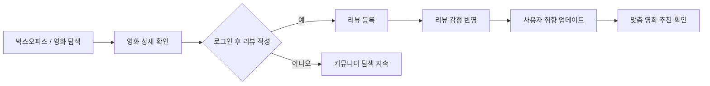

## 1. 프로젝트 개요 및 목표

**인사이드 무비**는 사용자 리뷰 텍스트를 감정 분석해 영화 추천에 반영하는 **영화 리뷰/추천 커뮤니티 서비스**입니다.

### 배경 및 목적
기존의 영화 커뮤니티들은 사용자가 영화에 대한 리뷰를 작성해도 그 정보가 사용자 개인화로 이어지지 않았습니다.
즉, 서비스 로직이 리뷰 작성 단계에서 끝나고, 사용자 리뷰 기반 추천으로 연결되는 흐름이 없었습니다.

이 프로젝트의 목표는 레이어드 아키텍처와 SOLID 원칙을 기반으로 백엔드 기본기를 갖춘 API 서버를 구축하고,
사용자 리뷰 텍스트를 AI 감정분석으로 처리하여 영화를 추천하는 커뮤니티 서비스를 만드는 것이었습니다.

### 핵심 사용자 시나리오



- 사용자는 먼저 박스오피스나 영화 상세를 조회하며 콘텐츠를 탐색합니다.
- 로그인한 사용자가 리뷰를 작성하면 그 리뷰는 사용자의 취향을 드러내는 신호로 반영됩니다.
- 이 흐름의 핵심은 리뷰 작성이 단순 게시글 등록으로 끝나지 않고, 이후 추천 경험까지 이어지는 서비스 루프를 만든다는 점입니다.

### 역할 및 달성 목표
프로젝트에서 데이터 모델링, 백엔드 API 설계/구현, AI 추론 연동을 담당했습니다.

#### 역할 및 기여
- **백엔드 API 설계 및 구현 (Movie/Review/Member/Auth)**: 영화·박스오피스·리뷰·회원/인증 도메인의 API 계약과 서비스 흐름을 설계했습니다.  
  박스오피스 조회/상세 API와 외부 영화 데이터 연동을 구현해 조회 기능의 실행 경로를 완성했습니다.
  ```chips
  BoxOfficeController | https://github.com/AutoeverInsideMovie/Insidemovie-BE/blob/a1cb4ed/src/main/java/com/insidemovie/backend/api/movie/controller/BoxOfficeController.java#L25 | code
  BoxOfficeService | https://github.com/AutoeverInsideMovie/Insidemovie-BE/blob/a1cb4ed/src/main/java/com/insidemovie/backend/api/movie/service/BoxOfficeService.java#L60 | code
  0f25f7f | https://github.com/AutoeverInsideMovie/Insidemovie-BE/commit/0f25f7f | commit
  a1cb4ed | https://github.com/AutoeverInsideMovie/Insidemovie-BE/commit/a1cb4ed | commit
  ```
- **인증/인가 및 보안 정책 정비 (Member/Auth)**: JWT 검증 규칙과 공개/보호 API 경로 정책을 정리했습니다.  
  인증 처리 기준을 일관화해 도메인별 접근 제어 해석 차이를 줄였습니다.
  ```chips
  SecurityConfig | https://github.com/AutoeverInsideMovie/Insidemovie-BE/blob/d605bba/src/main/java/com/insidemovie/backend/common/config/security/SecurityConfig.java#L91 | code
  d605bba | https://github.com/AutoeverInsideMovie/Insidemovie-BE/commit/d605bba | commit
  ```
- **리뷰-감정분석 연동 (Spring ↔ FastAPI)**: 리뷰 작성 시 감정 추론 호출과 외부 예외 표준화를 구현했습니다.  
  리뷰 데이터가 추천 로직으로 이어지는 연계 파이프라인을 구성했습니다.

- **데이터 정합성 및 AI 추론 구성**: 감정 입력/요약 계산 정합성을 보강하고 KoBERT 추론 서버를 구성했습니다.  
  감정 데이터의 저장·집계 기준을 맞춰 추천 입력 데이터의 일관성을 강화했습니다.
  ```chips
  MemberEmotionSummaryRequestDTO | https://github.com/AutoeverInsideMovie/Insidemovie-BE/blob/53aeac7/src/main/java/com/insidemovie/backend/api/member/dto/emotion/MemberEmotionSummaryRequestDTO.java#L14 | code
  MovieEmotionSummaryService | https://github.com/AutoeverInsideMovie/Insidemovie-BE/blob/ff72cbc/src/main/java/com/insidemovie/backend/api/movie/service/MovieEmotionSummaryService.java#L28 | code
  prediction service | https://github.com/AutoeverInsideMovie/Insidemovie-AI/blob/742123c/services/prediction.py#L11 | code
  53aeac7 | https://github.com/AutoeverInsideMovie/Insidemovie-BE/commit/53aeac7 | commit
  ff72cbc | https://github.com/AutoeverInsideMovie/Insidemovie-BE/commit/ff72cbc | commit
  742123c | https://github.com/AutoeverInsideMovie/Insidemovie-AI/commit/742123c | commit
  ```
- - -
#### 기술적 달성 목표
- Spring Boot 레이어드 아키텍처(Controller/Service/Repository)로 책임 경계를 명확히 분리
- JPA 기반 엔티티 관계 및 제약 조건 설계로 데이터 정합성 확보
- 리뷰/감정 데이터를 사용자 취향 신호로 구조화
- 리뷰 작성 → FastAPI 감정 분석 → Emotion 저장 → 요약 재계산 → 추천 반영 흐름 구현
- JWT 기반 인증/인가와 공개·보호 API 정책 분리로 접근 제어 일관성 확보
- 외부 API/AI 호출 실패를 공통 예외로 표준화해 API 응답 일관성 강화

- - -
