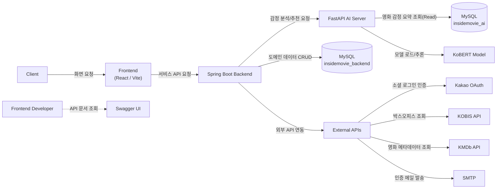
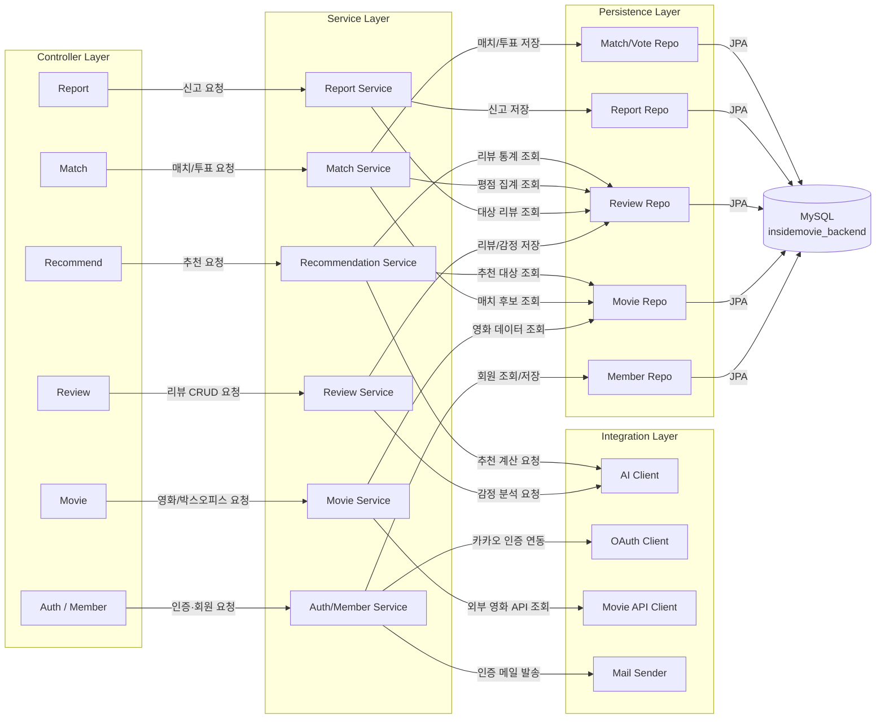
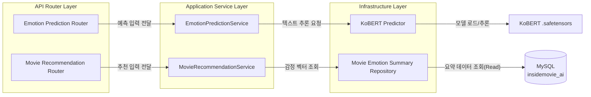
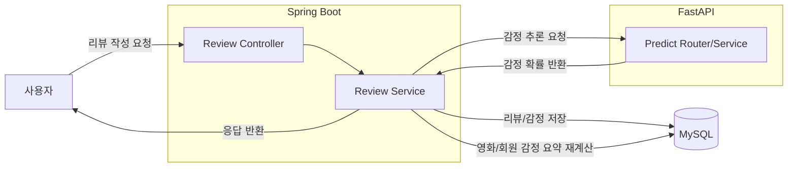
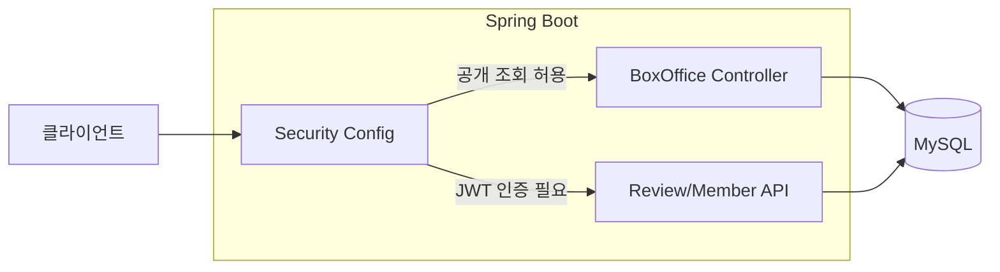
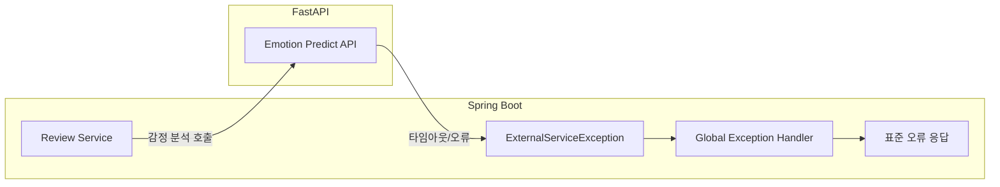

## 2. 시스템 아키텍처
시스템은 Spring Boot API 서버와 FastAPI AI 추론 서버로 구성되어 있으며, MySQL 단일 인스턴스 내에 backend/ai 스키마를 분리하여 운영했습니다.

### 시스템 컨텍스트
클라이언트 요청은 Spring Boot가 수신하고, 감정 분석은 FastAPI에게 위임하며, 데이터는 MySQL 스키마 분리 구조로 저장됩니다.

### Spring Boot 내부 구조
Spring Boot는 레이어드 아키텍터(`Controller` - `Service` - `Repository`)로 구성하여 인증, 리뷰, 영화/박스오피스 등의 도메인 로직을 분리했습니다.

### FastAPI 내부 구조
FastAPI는 KoBERT 기반 감정 추론 전용 서버로 동작하며, 예측 결과를 Spring Boot에 반환하는 내부 AI 서비스 역할을 담당합니다.

- - -
### 핵심 시나리오
#### 리뷰 작성 -> 감정분석 -> 감정 요약 반영

- 목적: 리뷰 이벤트를 감정 데이터로 변환해 추천 기반 데이터에 반영합니다.
- 예외 처리: AI 호출 실패 시 공통 예외로 변환해 일관된 오류 응답을 반환합니다.
- 결과: 리뷰 작성과 감정 요약 갱신이 하나의 흐름으로 연결됩니다.

#### 박스오피스 공개 조회와 인증 API 분리

- 목적: 비인증 조회 API와 인증 필요 API의 경계를 명확히 분리합니다.
- 예외 처리: 인증이 필요한 경로는 인증 실패 시 401/403으로 처리됩니다.
- 결과: 공개 조회 사용성은 유지하고 보호 API 접근 제어는 강화됩니다.

#### 외부 AI 연동 실패 대응 표준화

- 목적: 외부 의존 실패가 전체 API 동작을 불안정하게 만들지 않도록 합니다.
- 처리: 외부 호출 예외를 도메인 예외로 변환하고 공통 포맷으로 응답합니다.
- 결과: 장애 상황에서도 응답 규격이 유지되어 클라이언트 처리 일관성이 높아집니다.

- - -
