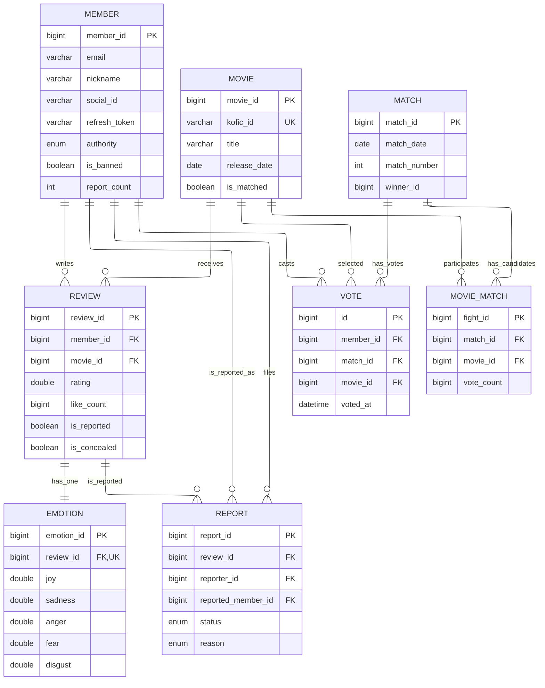
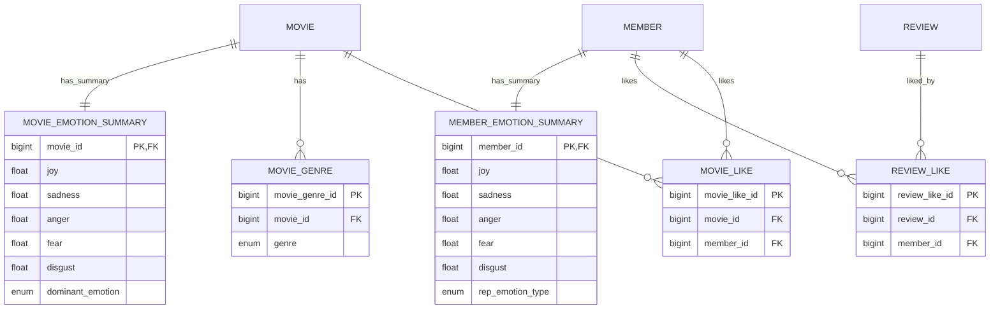
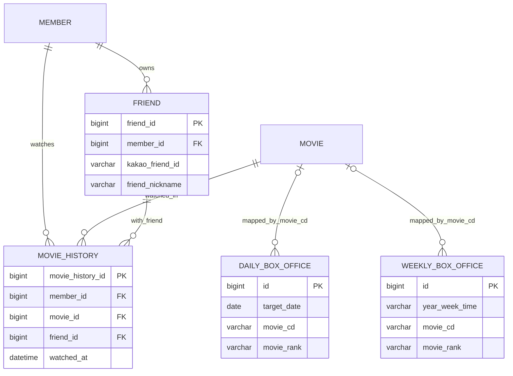

## 3. 도메인 데이터 구조
Inside Movie의 데이터 구조는 단순 게시판형 리뷰 서비스가 아니라, 리뷰가 감정 데이터와 추천 입력으로 이어지는 흐름을 반영하도록 설계했습니다. 그래서 회원, 영화, 리뷰 같은 기본 엔티티 위에 감정 집계, 공개 조회, 운영성 로그를 분리해 두는 방식이 중요했습니다.
#### 핵심 도메인 ERD (회원/영화/리뷰/신고/매치)
핵심 사용자 플로우(회원 활동, 리뷰 작성, 신고, 매치 투표) 중심 관계입니다.

#### 상세 도메인 ERD (선호/장르/집계 읽기모델)
핵심 도메인 위에서 동작하는 선호(Like), 장르 매핑, 감정 집계용 읽기 모델 관계입니다.

#### 상세 도메인 ERD (운영/로그/박스오피스)
운영성 데이터(친구, 시청 이력, 박스오피스 수집 데이터)를 분리한 관계입니다.

- - -
