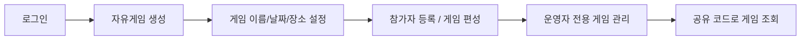

## 1. 프로젝트 개요 및 목표

**RallyOn / 랠리온**은 배드민턴 동호회나 지인 모임의 자유게임 운영을 더 안정적으로 관리할 수 있게 만든 **배드민턴 운영 서비스 플랫폼**입니다.

### 배경 및 목적

**배드민턴 모임 운영에는 생각보다 많은 수작업이 따릅니다.**
당일 참석자를 정리하고, 사용할 코트 수를 결정하고, 라운드마다 중복 없이 참가자를 배치하고, 각 참가자가 자신의 차례에 맞춰 지연 없이 경기에 들어갈 수 있도록 흐름을 조율해야 합니다.
기존에는 이 과정을 운영자가 보드에 직접 적어가며 관리하는 경우가 많았고, 그 결과 모임의 완성도는 운영자의 경험과 진행 역량에 크게 좌우되곤 했습니다.

**RallyOn의 목표**는 이 운영 과정을 단순한 게시판이나 기록 앱이 아니라, **운영 규칙을 구조화한 서비스 코어**로 만드는 것이었습니다.
그래서 **운영자가 세션을 안정적으로 수정**할 수 있는가, **게임이 끊기지 않고 매끄럽게 진행**되는가,
그리고 **간단한 설정만으로도 모임 성격에 맞는 운영 방식을 구현할 수 있는가**를 더 중요하게 보았습니다.
저는 이 기준을 화면보다 먼저 **서버 계약과 도메인 규칙으로 고정하는 것**에 집중했습니다.

### 핵심 사용자 시나리오



- 로그인한 사용자는 자유게임을 생성하고 날짜, 장소, 코트 수 같은 운영 설정을 저장할 수 있습니다.
- 운영자(`organizer`)는 참가자 등록과 라운드/매치 편성을 관리할 수 있으며, 수정 권한은 운영자에게만 부여됩니다.
- 공유 코드는 외부 공개 조회에 사용할 수 있고, 운영 상세 조회와 수정은 인증 경로로 분리됩니다.

### 주요 기능

```features
- **로그인**: OAuth 2.1 기반의 브라우저 쿠키 방식의 세션리스 로그인을 지원합니다. Refresh Token의 경우 토큰 회전으로 보안을 강화했습니다.

- **자유게임 생성**: 로그인한 사용자는 자유게임 세션을 생성하고 날짜, 장소, 코트 수 같은 운영 설정을 저장할 수 있습니다. 운영자는 참가자 등록과 라운드/매치 편성을 관리할 수 있고, 수정 권한은 organizer에게만 부여됩니다.

- **게임 공유 기능**: shareCode 기반 공개 조회를 통해 외부 사용자는 세션 요약을 읽을 수 있고, 운영 상세 조회와 수정은 인증 경로로 분리됩니다.

- **CI/CD 파이프라인**: GitHub Actions 기반으로 PR과 브랜치 시 백엔드 테스트/빌드를 수행하고, `main` 반영 시 이미지를 GHCR로 푸시한 뒤 EC2에서 `docker compose` 기반으로 배포합니다.
```