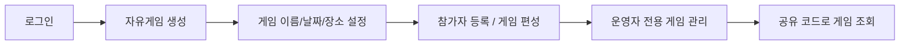

## 1. 프로젝트 개요 및 목표

**RallyOn**은 배드민턴 자유게임 운영을 더 안정적으로 관리할 수 있게 만든 서비스입니다.

### 서비스 개요

RallyOn은 배드민턴 자유게임 운영에 필요한 로그인, 프로필 설정, 장소 검색, 세션 생성, 참가자 관리, 라운드/매치 편성, 공유 조회 기능을 제공하는 서비스입니다.

이 서비스에서는 로그인 사용자가 자유게임을 생성하고 운영 설정을 저장할 수 있으며, 운영자(`organizer`)는 참가자 등록과 경기 편성을 관리합니다. 반면 공유 코드는 외부 사용자가 세션 요약을 조회하는 공개 경로로 사용돼, 운영 화면과 공유 조회 화면이 서로 다른 목적을 갖도록 설계했습니다.

즉 RallyOn의 서비스 가치는 단순 게시판이나 기록 기능보다, **자유게임 운영자가 실제로 세션을 만들고 참가자를 관리하고 경기를 편성하고 공유하는 흐름**을 하나의 제품 경험으로 제공하는 데 있습니다.

### 기술적 배경과 목표

RallyOn에서 먼저 풀어야 했던 문제는 화면 수보다 **인증 책임과 도메인 경계**였습니다. 배드민턴 모임 운영은 로그인 이후 참가자 등록, 라운드 편성, 코트 배정, 운영자 수정 권한이 한 흐름으로 이어지기 때문에, 브라우저 인증 흐름과 자유게임 운영 구조가 먼저 정리되지 않으면 규칙과 데이터 변경 경계가 함께 흔들립니다.

기술적으로는 아래 네 가지 목표를 먼저 고정했습니다.

- DDD와 헥사고날 아키텍처를 통해 사용자·자유게임·외부 의존의 도메인 경계를 분리
- TDD와 ArchUnit으로 기능과 모듈 경계를 함께 검증
- OAuth 2.1 기반으로 인증·인가 구조를 재정리
- reverse proxy와 로컬 HTTPS 환경으로 브라우저 인증 흐름을 반복 검증

이 기준을 먼저 고정해 두면 프런트는 로그인 UI와 사용자 흐름에 집중하고, 서버는 인증 규칙과 자유게임 운영 구조를 담당하는 방식을 유지할 수 있습니다. 이후 구현도 이 네 가지 목표를 중심으로 이어졌습니다.

### 핵심 사용자 시나리오



- 로그인한 사용자는 자유게임을 생성하고 날짜, 장소, 코트 수 같은 운영 설정을 저장할 수 있습니다.
- 운영자(`organizer`)는 참가자 등록과 라운드/매치 편성을 관리할 수 있으며, 수정 권한은 운영자에게만 부여됩니다.
- 공유 코드는 외부 공개 조회에 사용할 수 있고, 운영 상세 조회와 수정은 인증 경로로 분리됩니다.

### 핵심 구현 축

```features
- **DDD와 헥사고날 기반 도메인 경계 분리**: 자유게임 세션 본체, 설정, 참가자, 라운드/매치 편성, 외부 조회 의존을 변경 단위별로 나누고, use case가 어떤 운영 단위를 다루는지 구조 안에서 설명 가능하게 고정했습니다.

- **TDD와 ArchUnit 기반 구조 검증**: 인증 시나리오, 요청 validation, 운영 규칙, 모듈 의존 방향을 테스트와 ArchUnit 규칙으로 함께 검증해 구조 변경 시에도 회귀를 빠르게 확인할 수 있게 했습니다.

- **OAuth 2.1 기반 인증·인가 구조 재설계**: OAuth 2.1/OIDC Authorization Code + PKCE, secure cookie, 토큰 재발급 흐름을 기준으로 인증과 인가 책임을 정리하고, 브라우저에서 보이는 로그인 화면과 서버의 토큰 처리 역할을 분리했습니다.

- **reverse proxy 기반 브라우저 인증 흐름 설계**: `auth.rallyon.test` / `api.rallyon.test`, nginx proxy, mkcert, DUMMY provider를 기준으로 secure cookie 기반 브라우저 인증 흐름을 로컬에서도 실제와 비슷한 조건으로 검증했습니다.
```
