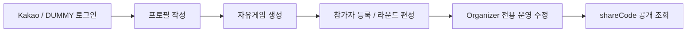

## 1. 프로젝트 개요 및 목표

**RallyOn / 랠리온**은 배드민턴 동호회나 지인 모임의 자유게임 운영을 시작점으로, 이후 대회 운영과 콘텐츠 영역까지 단계적으로 확장해갈 **배드민턴 서비스 플랫폼**입니다.

이 문서는 2026.03 저장소 기준으로 실제 구현된 범위를 중심으로 정리합니다. 현재 기준의 핵심 범위는 `로그인 -> 프로필 온보딩 -> 자유게임 생성 -> 라운드/매치 편성 -> 공유 코드 공개 조회`이며, 뉴스 허브와 정식 대회 운영은 후속 확장 범위로 남아 있습니다.

### 배경 및 목적

배드민턴 모임 운영은 의외로 반복적인 수작업이 많습니다. 누가 왔는지 정리하고, 코트를 몇 개 쓸지 결정하고, 라운드마다 중복 없이 사람을 배치하고, 외부 참가자에게 현재 세션 정보를 공유하는 일이 모두 운영자의 즉흥적인 판단에 의존하기 쉽습니다.

RallyOn의 목표는 이 흐름을 단순한 게시판이나 기록 앱이 아니라, **운영 규칙을 가진 플랫폼의 첫 코어 서비스**로 정리하는 것이었습니다. 그래서 초반부터 "로그인이 된다"보다 "운영자가 안전하게 세션을 수정할 수 있는가", "새 사용자가 프로필을 완성해야 다음 단계로 넘어가도록 흐름이 닫혀 있는가", "로컬 개발 환경에서도 secure cookie를 재현할 수 있는가"를 더 중요하게 봤습니다.

### 핵심 사용자 시나리오



- 신규 사용자는 로그인 후 `PENDING` 상태라면 바로 프로필 작성으로 이동합니다.
- 운영자는 세션 제목, 코트 수, 라운드 수, 장소, 참가자 목록을 구성한 뒤 라운드/매치 보드를 운영합니다.
- 공개 공유 링크는 세션 요약을 외부에 전달하는 경계로 사용하고, 운영용 상세 편집은 로그인 사용자에게만 남겨 둡니다.

### 역할 및 기여

프로젝트에서는 **백엔드 개발 + 인프라 협업** 역할을 중심으로 참여했습니다. 제 관심사는 화면을 많이 늘리는 것보다, 자유게임 도메인의 운영 규칙을 서버 계약으로 먼저 고정하고 로컬 환경에서도 그 흐름을 안정적으로 재현할 수 있게 만드는 것이었습니다.

- **쿠키 기반 인증과 프로필 온보딩 흐름 정리**: Kakao OAuth와 로컬 DUMMY 로그인, secure cookie 발급, `PENDING -> ACTIVE` 프로필 온보딩을 하나의 사용자 흐름으로 맞췄습니다.
  ```chips
  AuthController | https://github.com/RallyOnPrj/backend/blob/7c54b37e8aff815764cf8ba7de69c7b96201e399/src/main/java/com/gumraze/rallyon/backend/auth/controller/AuthController.java | code
  UserController | https://github.com/RallyOnPrj/backend/blob/7c54b37e8aff815764cf8ba7de69c7b96201e399/src/main/java/com/gumraze/rallyon/backend/user/controller/UserController.java | code
  fix: 로컬 Docker DUMMY OAuth 로그인 활성화 | https://github.com/RallyOnPrj/backend/commit/28be906084d89b4f11a8faab1241e08c877f0e28 | commit
  feat: 쿠키 기반 인증과 글로벌 네비게이션 정렬 | https://github.com/RallyOnPrj/frontend/commit/531f1e8b0881f0c817d5012c21895e1bdfd453d9 | commit
  feat: 랜딩·프로필·뉴스 화면을 RallyOn 구조로 재구성 | https://github.com/RallyOnPrj/frontend/commit/94fd3ed824ff078e0d0e14c67d68955e9e548e53 | commit
  ```

- **자유게임 생성과 운영 규칙 설계**: 게임 생성, 참가자 등록, organizer 전용 수정, 라운드/매치 편성, 공개 공유 조회를 운영 단위의 API로 설계했습니다.
  ```chips
  CourtManagerController | https://github.com/RallyOnPrj/backend/blob/7c54b37e8aff815764cf8ba7de69c7b96201e399/src/main/java/com/gumraze/rallyon/backend/courtManager/controller/CourtManagerController.java | code
  FreeGameRoundMatchSaveServiceTest | https://github.com/RallyOnPrj/backend/blob/7c54b37e8aff815764cf8ba7de69c7b96201e399/src/test/java/com/gumraze/rallyon/backend/courtManager/service/FreeGameRoundMatchSaveServiceTest.java | code
  feat: 자유게임 생성 애플리케이션 유즈케이스 추가 | https://github.com/RallyOnPrj/backend/commit/52b0796ee1357ea4497b92726a755fd95ef5e26f | commit
  feat: 자유게임 공유 링크 공개 조회 기능 추가 | https://github.com/RallyOnPrj/backend/commit/93f3ae85225c0b638aa0c6a00f790af612c48249 | commit
  refactor: 자유게임 라운드 매치 UUID 전환과 저장 검증 정리 | https://github.com/RallyOnPrj/backend/commit/7c54b37e8aff815764cf8ba7de69c7b96201e399 | commit
  feat: 자유게임 생성 플로우와 코트 배정 UI 개선 | https://github.com/RallyOnPrj/frontend/commit/551557c975a94aea2bda8c349442cfc10adbd7d8 | commit
  ```

- **로컬 HTTPS 기반 협업 환경 정리**: `frontend / backend / infra`를 분리한 상태에서 secure cookie와 HMR이 모두 동작하도록 `.test` 도메인, nginx 프록시, live dev 워크플로를 정리했습니다.
  ```chips
  infra README | https://github.com/RallyOnPrj/infra/blob/b13c4cb9e9baf3c05fc9bda4ed6e5c1d1cf1858d/README.md | code
  Makefile | https://github.com/RallyOnPrj/infra/blob/b13c4cb9e9baf3c05fc9bda4ed6e5c1d1cf1858d/Makefile | code
  fix: 로컬 .test 도메인 및 실행 가이드 정리 | https://github.com/RallyOnPrj/infra/commit/691a5d1ec2c35329252ba189753e01c2b3e7356a | commit
  docs: 로컬 테스트 로그인 설정 정리 | https://github.com/RallyOnPrj/infra/commit/518a92a4de5407cfada47451cf81e45004a7b9cc | commit
  fix: 프론트 실시간 개발 타깃 및 help 정리 | https://github.com/RallyOnPrj/infra/commit/fe714ec78326e0d8b2d16ce69595d30942d70f83 | commit
  ```

### 기술적 달성 목표

- Kakao OAuth와 DUMMY 로그인, secure cookie, refresh 흐름을 로컬/운영 공통 계약으로 정리
- 프로필 온보딩과 지역 조회를 인증 다음 단계의 필수 흐름으로 고정
- 자유게임 생성, 라운드/매치 편성, organizer 권한 수정 규칙을 API와 테스트로 검증
- shareCode 기반 공개 조회와 운영용 상세 수정의 경계를 분리
- Docker Compose, nginx, mkcert 기반으로 협업 가능한 로컬 HTTPS 환경을 구축
