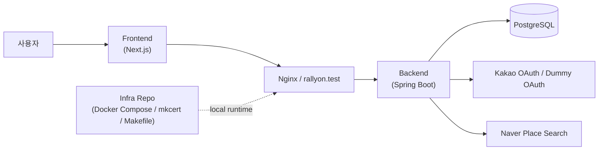
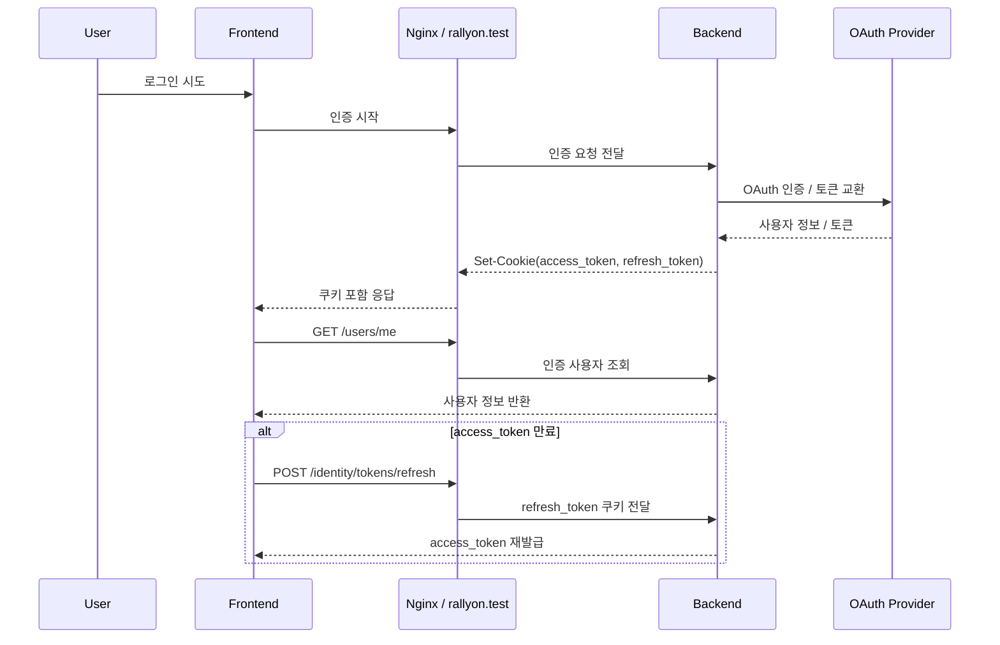
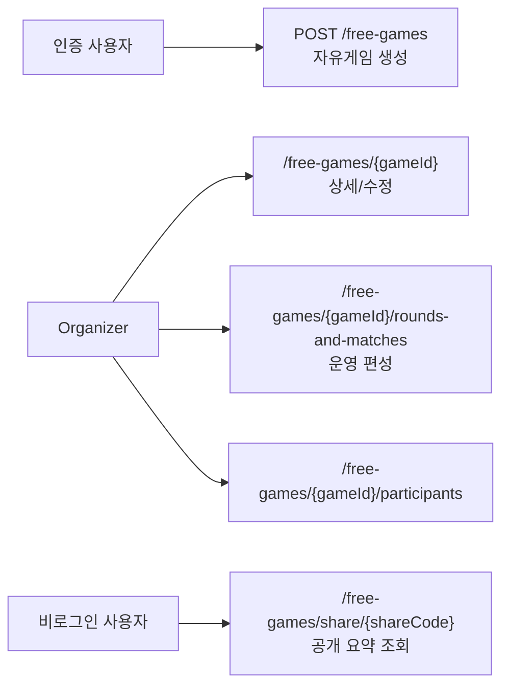

## 2. 시스템 아키텍처

RallyOn에서 아키텍처를 설명할 때 가장 중요한 것은 "어떤 패턴을 썼는가"보다 **어떤 실행 경계와 운영 경계를 먼저 고정했는가**입니다. 이 프로젝트에서는 브라우저 인증 흐름, organizer 전용 운영 API, 공개 share 조회 API가 서로 섞이지 않도록 실행 경로를 나누는 판단이 먼저였습니다.

### 시스템 컨텍스트

- 프런트는 로그인 진입, 자유게임 운영 화면, 공개 공유 화면을 담당합니다.
- 백엔드는 인증, 사용자/프로필, 지역 조회, 장소 검색, 자유게임 운영 API와 공개 조회 API를 담당합니다.
- Nginx와 인프라 레포는 `rallyon.test`, `auth.rallyon.test`, `api.rallyon.test` 실행 경계를 고정해 브라우저 기준 인증 흐름을 실제와 비슷하게 검증할 수 있게 합니다.

### 인증과 쿠키 기반 세션 흐름

RallyOn에서 가장 큰 구현 판단 중 하나는 토큰을 localStorage에 두지 않고 **HttpOnly + Secure 쿠키**로 다루는 것이었습니다. 이 선택은 브라우저 보안 모델과 더 잘 맞지만, 로컬에서도 HTTPS와 호스트 구성이 먼저 맞아야 실제 흐름을 검증할 수 있습니다.

- `access_token`은 `.rallyon.test` 범위의 쿠키로 사용되고, `refresh_token`은 `auth.rallyon.test` 호스트 전용 쿠키로 분리됩니다.
- `HttpOnly + Secure` 쿠키를 사용하기 때문에 단순 `localhost` 포트 조합만으로는 실제 브라우저 동작을 충분히 검증하기 어려웠습니다.
- DUMMY provider는 운영 기능이 아니라, secure cookie 인증과 refresh 흐름을 로컬에서 반복 테스트하기 위한 개발용 진입점으로 두었습니다.

이 실행 경계를 먼저 고정한 덕분에 프런트는 로그인 UI와 사용자 여정을 담당하고, 백엔드는 인가 코드 교환, 토큰 검증, 재발급 같은 인증 규칙을 담당하는 방식으로 역할을 나눌 수 있었습니다.

### 운영 API와 공개 조회 경계

자유게임은 같은 데이터라도 운영용 수정 API와 외부 공유 API의 요구사항이 다릅니다. RallyOn에서는 이를 한 화면 안에서 섞지 않고 **organizer 전용 운영 경계**와 **public share 경계**로 분리했습니다.

- 인증 사용자는 자유게임을 생성할 수 있고, 생성 이후 운영 권한은 organizer에게 귀속됩니다.
- 운영 경로는 organizer 권한 검증을 통과한 경우에만 수정이 가능하고, 라운드 안의 중복 참가자 배정도 서버에서 함께 검증합니다.
- 공개 공유는 `shareCode` 기준의 요약 정보만 노출해, 세션 배포와 운영 편집을 구분했습니다.
- 현재 저장소 기준으로 공개 공유 화면은 세션 요약까지만 연결되어 있고, 참가자 목록이나 라운드 보드는 후속 범위로 남아 있습니다.

결과적으로 자유게임 운영 화면의 변경이 공개 조회 계약을 직접 흔들지 않도록 경계를 나눌 수 있었고, 이후 기능 추가 시에도 어떤 경로가 인증을 필요로 하는지 더 분명하게 유지할 수 있었습니다.

### 테스트와 구조 검증

RallyOn에서는 구현을 마친 뒤 테스트를 붙인 것이 아니라, 인증 흐름과 운영 규칙이 깨지지 않는지 계속 확인할 수 있는 검증 기준을 함께 가져갔습니다.

- controller validation 테스트로 요청 필드와 인증/인가 실패를 검증했습니다.
- service/use-case 테스트로 organizer 권한, 참가자 배정, 공개 조회 같은 운영 규칙을 검증했습니다.
- ArchUnit 규칙으로 모듈 의존 방향과 인증 경계가 무너지지 않는지 확인했습니다.

이 검증 기준 덕분에 인증 흐름이나 자유게임 구조를 변경할 때도 "기능이 동작하는가"뿐 아니라 "경계가 유지되는가"를 함께 확인할 수 있었습니다.

### 로컬 인증 실행 환경

- `infra/Makefile`은 `make up`, `make up-live fe`, `make ps`, `make logs` 같은 실행 명령을 공통 진입점으로 제공합니다.
- `docker-compose.yml`과 `docker-compose.dev.yml`을 분리해 일반 실행과 프런트 live dev 모드를 나눴습니다.
- `mkcert`와 `.test` 도메인을 사용해 secure cookie가 필요한 인증 흐름을 브라우저에서 실제와 유사하게 검증할 수 있게 했습니다.

이 실행 환경 덕분에 인증을 단순 백엔드 코드가 아니라 브라우저까지 포함한 제품 실행 경계로 다룰 수 있었고, 팀 단위로도 같은 조건에서 반복 검증할 수 있는 기반을 마련했습니다.
