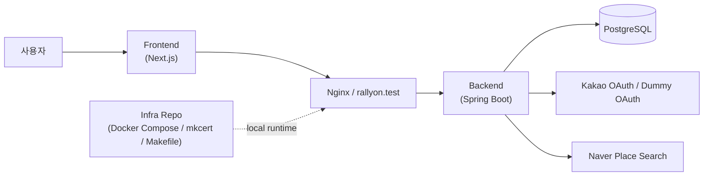
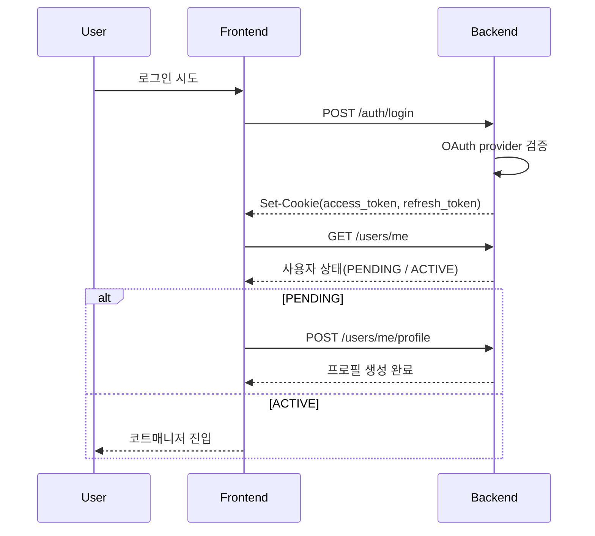
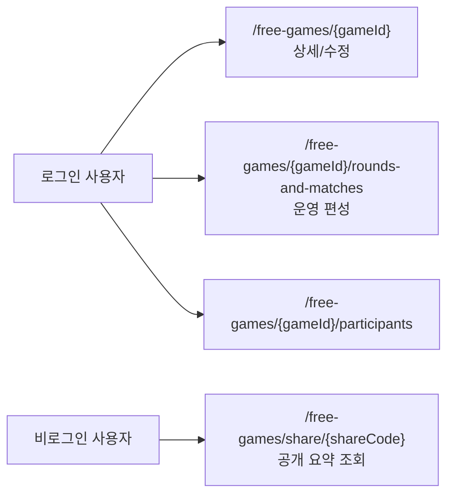

## 2. 시스템 아키텍처

RallyOn은 단일 레포 안에서 모든 것을 처리하기보다, **frontend / backend / infra**를 분리한 워크스페이스 구조로 운영됩니다. 이 구조의 장점은 화면 개발, 도메인 API, 로컬 실행 환경의 책임을 나눌 수 있다는 점이었고, 특히 secure cookie 인증을 제대로 검증하려면 인프라 레이어를 별도로 두는 편이 훨씬 안정적이었습니다.

### 시스템 컨텍스트

- 프런트는 Next.js App Router 기반으로 로그인, 프로필, 코트매니저, 공개 공유 화면을 담당합니다.
- 백엔드는 인증, 사용자/프로필, 지역 조회, 장소 검색, 자유게임 운영 API를 담당합니다.
- 인프라 레포는 nginx 프록시, Docker Compose, `.test` 도메인, 로컬 인증서 생성을 포함한 실행 환경을 담당합니다.

### 인증과 세션 흐름

RallyOn에서 가장 중요한 운영 판단 중 하나는 토큰을 단순 localStorage에 두는 대신 **HttpOnly + Secure 쿠키**로 다루는 것이었습니다. 그래서 로컬에서도 HTTPS와 도메인 구성이 먼저 준비되어야 했습니다.

- `access_token`은 전체 애플리케이션 경로에서 사용되고, `refresh_token`은 `/auth` 경로에 한정된 쿠키로 나뉩니다.
- 신규 사용자는 로그인 직후 `PENDING` 상태이면 `/profile/setup`으로 보내고, 프로필을 완료해야 운영 화면으로 진입할 수 있게 했습니다.
- DUMMY provider는 운영 기능이 아니라, secure cookie 인증을 로컬에서 반복 테스트하기 위한 개발용 진입점으로 두었습니다.

### 운영 API와 공개 경계

자유게임은 같은 도메인이라도 운영용 수정 API와 외부 공유 API의 요구사항이 다릅니다. RallyOn에서는 이를 한 화면 안에서 섞지 않고 **organizer 전용 운영 경계**와 **public share 경계**로 분리했습니다.

- 운영 경로는 로그인 사용자 중에서도 organizer 권한 검증을 통과한 경우에만 수정이 가능합니다.
- 공개 공유는 `shareCode` 기준의 요약 정보만 노출해, 세션 배포와 운영 편집을 구분했습니다.
- 현재 저장소 기준으로 공개 공유 화면은 세션 요약까지만 연결되어 있고, 참가자 목록이나 라운드 보드는 후속 범위로 남아 있습니다.

### 협업 환경 아키텍처

- `infra/Makefile`은 `make up`, `make up-live fe`, `make ps`, `make logs` 같은 실행 명령을 공통 진입점으로 제공합니다.
- `docker-compose.yml`과 `docker-compose.dev.yml`을 분리해 일반 실행과 프런트 live dev 모드를 나눴습니다.
- `mkcert`와 `.test` 도메인을 사용해 secure cookie가 필요한 인증 흐름을 브라우저에서 실제와 유사하게 검증할 수 있게 했습니다.
