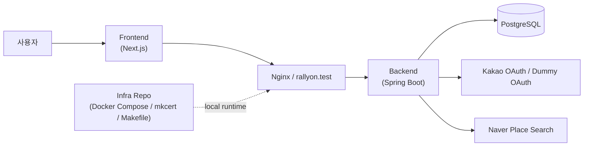
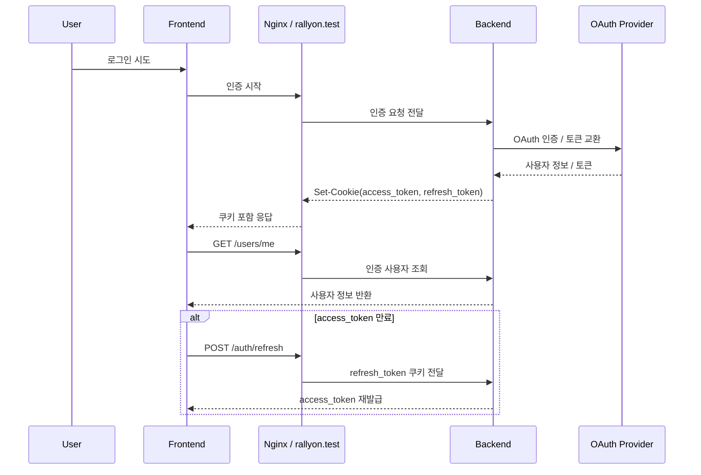
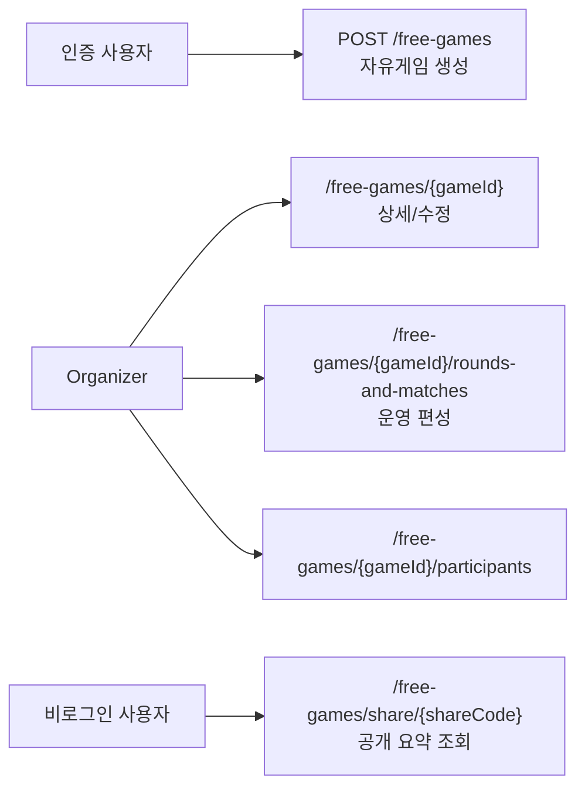

## 2. 시스템 아키텍처

RallyOn의 핵심 구조는 `Frontend -> Nginx(rallyon.test) -> Spring Boot Backend`로 이어지는 실행 경로와, 그 뒤에서 OAuth provider, PostgreSQL, 공개 shareCode 조회 경계를 분리한 것입니다. 특히 브라우저 쿠키 방식 인증을 안정적으로 검증하려면 애플리케이션 코드뿐 아니라 프록시, 도메인, HTTPS 실행 환경이 함께 맞아야 했습니다.

### 시스템 컨텍스트

- 프런트는 Next.js 기반으로 로그인 진입, 자유게임 운영 화면, 공개 공유 화면을 담당합니다.
- 백엔드는 인증, 사용자/프로필, 지역 조회, 장소 검색, 자유게임 운영 API와 공개 조회 API를 담당합니다.
- Nginx와 인프라 레포는 `rallyon.test` 도메인, HTTPS, Docker Compose 실행 환경을 고정해 브라우저 기준 인증 흐름을 검증할 수 있게 합니다.

### 인증과 쿠키 기반 세션 흐름

RallyOn에서 가장 중요한 백엔드 판단 중 하나는 토큰을 localStorage에 두지 않고 **HttpOnly + Secure 쿠키**로 다루는 것이었습니다. 이 방식은 브라우저 보안 모델과 더 잘 맞지만, 로컬에서도 HTTPS와 도메인 구성이 먼저 준비되어야 한다는 전제가 함께 따라옵니다.

- `access_token`은 전체 애플리케이션 경로에서 사용되고, `refresh_token`은 `/auth` 경로에 한정된 쿠키로 나뉩니다.
- `HttpOnly + Secure` 쿠키를 사용하기 때문에 단순 `localhost` 포트 조합만으로는 실제 브라우저 동작을 충분히 검증하기 어려웠습니다.
- DUMMY provider는 운영 기능이 아니라, secure cookie 인증과 refresh 흐름을 로컬에서 반복 테스트하기 위한 개발용 진입점으로 두었습니다.

### 운영 API와 공개 조회 경계

자유게임은 같은 도메인이라도 운영용 수정 API와 외부 공유 API의 요구사항이 다릅니다. RallyOn에서는 이를 한 화면 안에서 섞지 않고 **organizer 전용 운영 경계**와 **public share 경계**로 분리했습니다.

- 인증 사용자는 자유게임을 생성할 수 있고, 생성 이후 운영 권한은 organizer에게 귀속됩니다.
- 운영 경로는 organizer 권한 검증을 통과한 경우에만 수정이 가능합니다.
- 공개 공유는 `shareCode` 기준의 요약 정보만 노출해, 세션 배포와 운영 편집을 구분했습니다.
- 현재 저장소 기준으로 공개 공유 화면은 세션 요약까지만 연결되어 있고, 참가자 목록이나 라운드 보드는 후속 범위로 남아 있습니다.

### 로컬 인증 실행 환경

- `infra/Makefile`은 `make up`, `make up-live fe`, `make ps`, `make logs` 같은 실행 명령을 공통 진입점으로 제공합니다.
- `docker-compose.yml`과 `docker-compose.dev.yml`을 분리해 일반 실행과 프런트 live dev 모드를 나눴습니다.
- `mkcert`와 `.test` 도메인을 사용해 secure cookie가 필요한 인증 흐름을 브라우저에서 실제와 유사하게 검증할 수 있게 했습니다.
