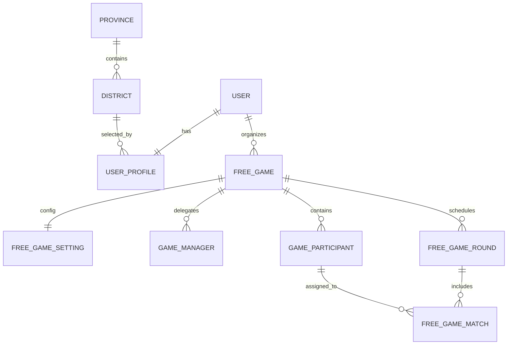
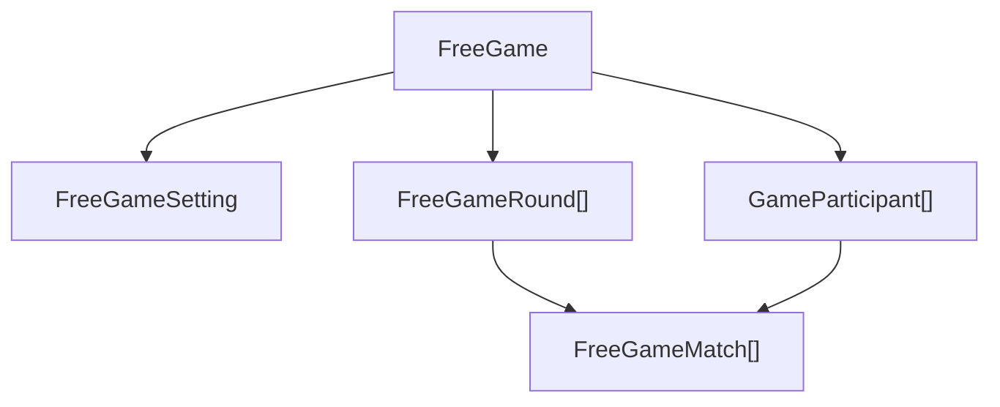

## 3. 도메인 데이터 구조

RallyOn의 데이터 구조는 화면보다 **운영 단위와 변경 경계가 무엇인가**를 먼저 반영하도록 설계돼 있습니다. DDD와 헥사고날 아키텍처 안에서 중요한 것은 게시글이나 피드보다, 하나의 자유게임 세션을 생성하고 설정을 바꾸고 참가자를 관리하고 라운드별 매치를 편성하는 흐름을 어떤 단위로 나눌지였습니다. 이 섹션은 자유게임 운영 구조를 어떤 도메인 경계로 설명 가능하게 만들었는지 보여주는 근거에 가깝습니다.

### 핵심 도메인 ERD



- `USER / USER_PROFILE`은 인증 계정과 실제 운영에 필요한 프로필 정보를 분리합니다.
- 지역 선택은 `Province -> District` 구조로 나누고, 프로필 작성 시 여기에 연결합니다.
- `FREE_GAME`은 세션 자체이고, `FREE_GAME_SETTING`은 코트 수·라운드 수 같은 운영 설정을 담당합니다.
- `GAME_PARTICIPANT`는 실제 계정 사용자뿐 아니라 게스트성 입력도 받을 수 있도록 세션 내부 참가자 개념으로 분리합니다.
- `FREE_GAME_ROUND / FREE_GAME_MATCH`는 "한 게임 안에서 여러 라운드와 코트가 반복된다"는 운영 구조를 그대로 표현합니다.
- 즉, 세션 본체와 설정, 참가자, 편성 단위를 나눈 이유는 organizer 권한과 운영 규칙을 변경 단위별로 고정하고, 사용자/자유게임/외부 의존이 한 레이어에 섞이지 않도록 도메인 경계를 설명 가능하게 만들기 위해서였습니다.

### 왜 설정, 참가자, 편성을 분리했는가

자유게임을 운영하다 보면 세션의 기본 정보, 참가자 목록, 실제 편성 보드는 서로 변경 주기가 다릅니다.

- 세션 제목, 장소, 경기 기록 방식은 **기본 설정 변경**
- 참가자 추가/수정은 **명단 관리**
- 라운드/코트 배정은 **실시간 운영**

이걸 하나의 거대한 요청으로 묶어 두면 수정 충돌도 많아지고 검증도 어려워집니다. 그래서 RallyOn은 세션 본체와 편성 데이터를 나눠, 운영자가 어떤 단위를 수정하는지 API 레벨에서도 명확하게 유지했습니다. 이는 헥사고날 구조 안에서 use case가 어떤 운영 단위를 다루는지 분명하게 나누는 기준이기도 했고, 이후 테스트와 ArchUnit으로 검증할 수 있는 구조 단위가 되기도 했습니다.

### 운영 규칙 중심 데이터 포인트



- 공개 공유는 내부 식별자 대신 `shareCode`를 사용해 외부 접근 경계를 분리합니다.
- 라운드는 `game + roundNumber`, 매치는 `round + courtNumber` 조합으로 유일성을 갖도록 설계합니다.
- 현재 저장소 기준 운영 API는 게임/참가자 식별자를 UUID 기준으로 다루고, 공유 링크는 사람이 전달 가능한 `shareCode`를 따로 둡니다.

### 프로필과 지역, 장소 검색의 연결

RallyOn의 프로필은 단순 닉네임 저장이 아니라 이후 운영 흐름에 필요한 기본 메타데이터를 담습니다.

- 닉네임
- 지역(시/도, 시/군/구)
- 성별
- 생년월일
- 지역/전국 급수

자유게임 생성 단계에서는 여기에 별도로 **장소 검색**이 연결됩니다. 장소 자체를 거대한 마스터 테이블로 먼저 들고 가기보다, 운영 시점에 검색 결과를 받아 세션의 location에 반영하는 방식으로 단순화했습니다. 즉, 인증 이후 운영 진입 흐름은 `프로필 -> 지역 -> 장소 -> 자유게임 생성` 계약까지 포함한 구조였습니다. 이 흐름은 대표 트러블슈팅에서 따로 분리하지 않고, 자유게임 운영 구조를 지탱하는 온보딩/운영 진입 근거로 이 섹션에 남겨 둡니다.

### 현재 저장소 기준으로 확인된 구조

```chips
FreeGame | https://github.com/RallyOnPrj/backend/blob/7c54b37e8aff815764cf8ba7de69c7b96201e399/src/main/java/com/gumraze/rallyon/backend/courtManager/entity/FreeGame.java | code
FreeGameMatch | https://github.com/RallyOnPrj/backend/blob/7c54b37e8aff815764cf8ba7de69c7b96201e399/src/main/java/com/gumraze/rallyon/backend/courtManager/entity/FreeGameMatch.java | code
GameParticipant | https://github.com/RallyOnPrj/backend/blob/7c54b37e8aff815764cf8ba7de69c7b96201e399/src/main/java/com/gumraze/rallyon/backend/courtManager/entity/GameParticipant.java | code
feat(courtManager): 코트 매니저 관련 테이블 추가 | https://github.com/RallyOnPrj/backend/commit/347c2f707cffeab5365b30e148191b66cb56e9da | commit
feat(db): Flyway 기반 초기 스키마 및 지역 데이터 추가 | https://github.com/RallyOnPrj/backend/commit/8b24cf8e7888fc40259a4fd3483cf0a832d697b0 | commit
refactor: 자유게임 라운드 매치 UUID 전환과 저장 검증 정리 | https://github.com/RallyOnPrj/backend/commit/7c54b37e8aff815764cf8ba7de69c7b96201e399 | commit
```
